# The Clockwork Dark

**An emergent-story engine for local AI.** A deterministic engine holds the
truth: time, dice, money, law, what the city's schemers did last night. Local
LLM agents only narrate it. Seeded systems run into each other, the engine
settles the result, and a model on your own machine writes the prose.

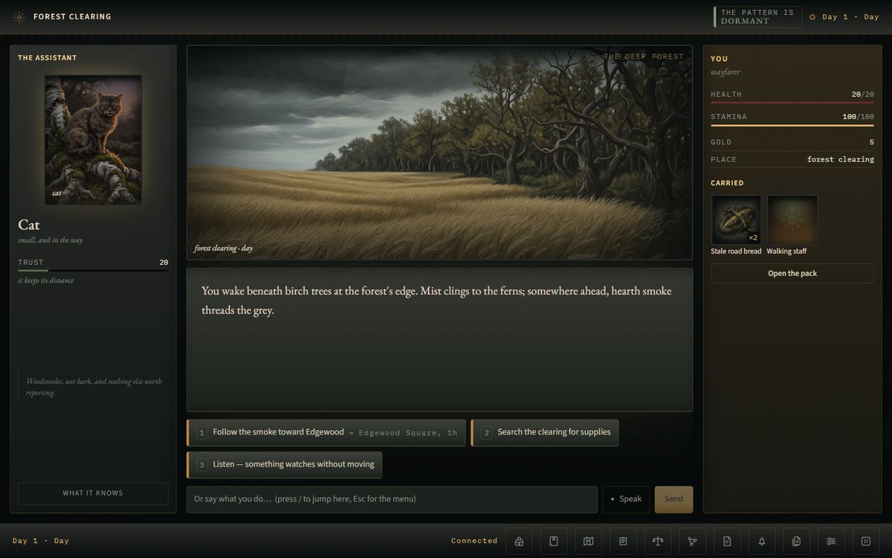

- **The engine resolves, the LLM narrates.** A choice that moves, spends or
  risks anything carries a structured `intent`. The engine runs it *before* the
  next word is written, and the model is handed the receipt as authoritative
  input. It is never asked to invent an outcome.
- **Illegal actions can't be sampled.** The output grammar is a JSON Schema
  built fresh every turn from what the engine will actually accept: the roads
  leaving *this* place, the NPCs *in the room*, the goods *this* vendor sells
  that you can afford. An unreachable destination is not in the enum.
- **Seeds replay.** Each system draws from its own named RNG stream, and world
  time moves only through one function. The same seed and the same choices
  give the same world, and adding a new dice roll doesn't shift the caravan
  schedule.
- **Every mechanic reaches the prose.** A mechanic the narrator can't mention
  would feel like a random event, so the suite checks three things: is each
  mechanic called, does the narration hear about it, and does the prose agree
  with the receipt. An evaluator rejects success narrated over a failed check,
  and a refused move produces an engine-written refusal rather than silence.
- **Local-first.** It runs against LM Studio on your own hardware. Image
  generation, voice and ComfyUI are optional and **off by default**. The
  shipped art packs mean scenes have pictures without any of them.

**Status:** **v0.14.1** is the current release; **v0.15.0** is in progress.
Six stories ship, and each can be played to an ending. At v0.14.0 the suite
stood at 3030 passing, 4 skipped, plus 144 client tests. Those numbers are
re-measured each release in [CLAUDE.md](CLAUDE.md), and
[CHANGELOG.md](CHANGELOG.md) records every change from 0.4.0 on.

---

## Contents

- [The stories](#the-stories)
- [Features](#features)
- [How the engine works](#how-the-engine-works)
- [Getting started](#getting-started)
- [Roadmap](#roadmap)
- [Documentation](#documentation)

---

## The stories

The engine doesn't know any of these stories exist. Each one is a directory
under `games/<slug>/` with a manifest (`game.yaml`) that declares which systems
it uses. **A story pays nothing for a system it doesn't declare, and the test
suite checks that its turns stay byte-identical.** Pick one with
`launcher.py --game <slug>`.

| Story | Slug | Genre and register | Leans on | What sets it apart |
|---|---|---|---|---|
| **The Clockwork Dark** | `clockwork-dark` | Grounded low fantasy. A frontier village, and something brass winding outward from the Wound | Travel graph, survival, crafting, encounters, awareness-gated arcs, the evil clock, death rules | The flagship. The evil advances whether you become a hero or a baker, and the quiet life counts as a complete game |
| **The Wicked Garden** | `wicked-garden` | Fae-court bargain. One day in the garden costs ten at home | Scene decks, veiled meters, clocks, threads, many endings | The deck exemplar, with no HP, no hunger, no travel graph and no dice. It shows the engine isn't one game with the nouns swapped |
| **NEON CITY: THE CROSSING** | `neon-city` | Cyberpunk survival expedition across the Sprawl on a 21-day timestamp | Graph world, scavenge economy, a doom-style clock that quests can make *slip*, debt escalation, threads, six ending classes | A graph story with no evil clock. The pressure comes from heat, debt, the weather and the file |
| **THE LONG CON** | `the-long-con` | Rain-and-radiator noir. A client, a photograph, a man already dead | Graph city with road encounters, a shop, and a clock that forces an authored deck scene | The first hybrid: a walkable city with a set-piece deck inside it. It also has secret places, a clue board, gossip, and a continuity guard that rejects a scene greeting someone you know as a stranger |
| **HUE & CRY** | `hue-and-cry` | Wry, warm thief's comedy with real gallows. Tallowmere, a candle-port, where everyone has decided you are the Magpie | Premises, the Law, jobs and flashbacks, NPC agendas, survival, labour, factions, lore | The systems-heavy one, and the story in progress toward v1.0.0. The world schemes, robs and hunts on its own clock |
| **Dev Story** | `dev-story` | Not a game: the annotated bench. A house, a university and eight people | One small working instance of every subsystem, plus the multi-agent pipeline | The worked example the story templates are distilled from. Change one thing and see what it does |

<details open>
<summary><b>The Clockwork Dark</b>, the flagship</summary>

You wake at the forest's edge beside Edgewood, the last comfortable village
before the Marches. The **evil clock** ticks through `dormant`, `stirring`,
`spreading` and `consuming` whatever you do. Four story arcs (quiet life,
whisper, march, convergence) open on **awareness**, a hidden stat, so a baker
who never listens to the caravan master stays a baker. It has 24 quests,
survival with rest that is never gated, crafting and recipes, trade, encounters
played as scenes rather than a combat system, death rules, and an in-world
companion (the Assistant) whose trust you earn. It has the largest shipped art
pack and its own UI plugin.

| Title screen | The map |
|---|---|
| 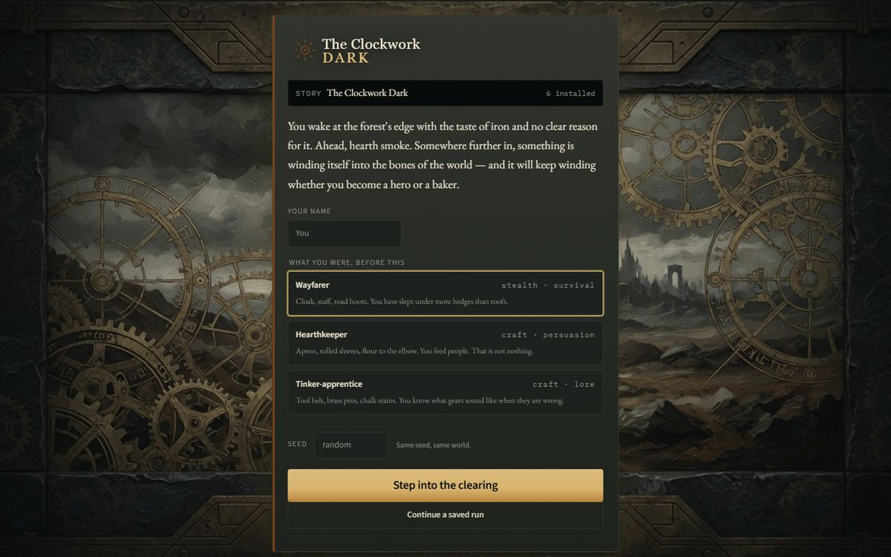 | 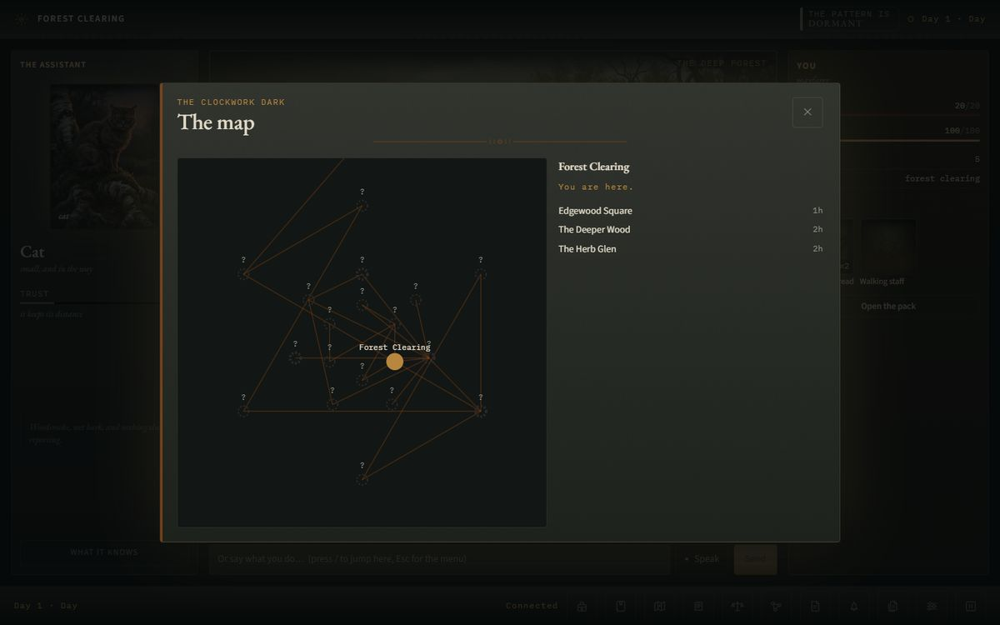 |


</details>

<details>
<summary><b>The Wicked Garden</b>, the deck exemplar</summary>

A garden between worlds, and a High Fae who has decided she wants you. Play
runs through authored **scene decks**: days, cards, gates and bands. **Time
debt** charges ten mortal days for each one spent inside. Its meters are
**veiled**: the client gets a band word ("closed", "loose", "cool") and never
the number, and the test suite enforces that. It has two pipeline agents (a GM
and Sophia), each kept away from the other's secrets.

| Opening | A deck card, after stepping through the gate |
|---|---|
| 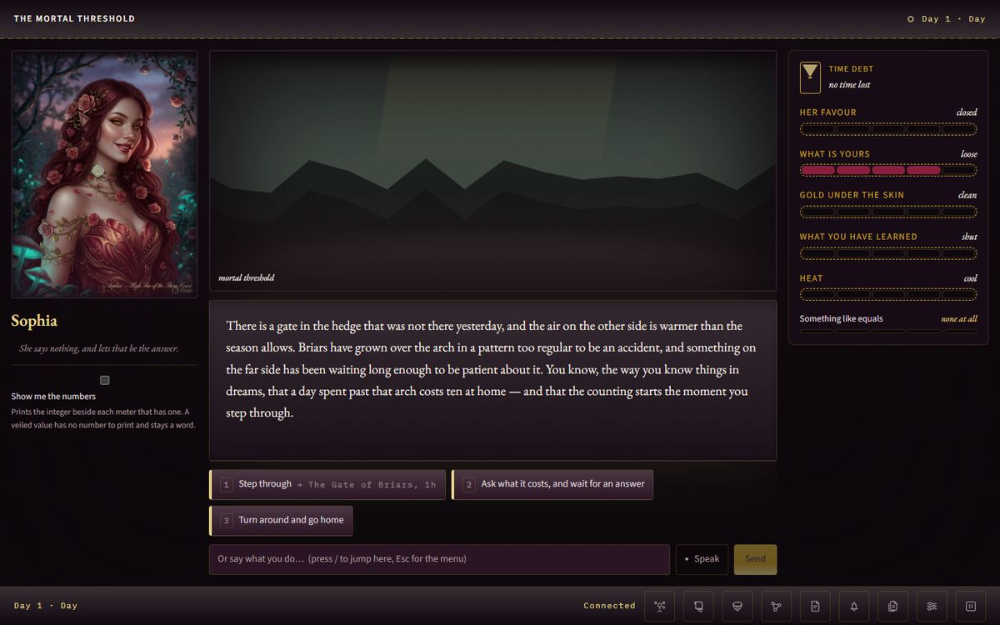 | 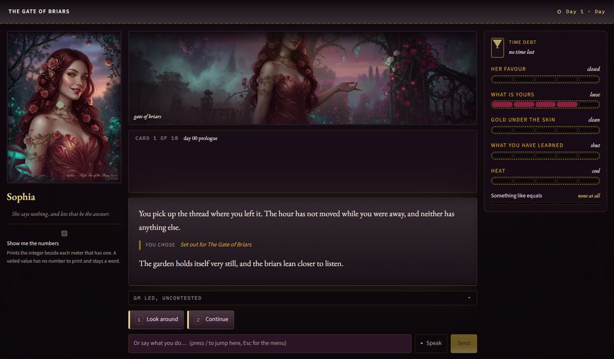 |


</details>

<details>
<summary><b>NEON CITY: THE CROSSING</b></summary>

Somebody sold you forty seconds of your own death, with a timestamp 21 days
out. Fourteen locations across four altitudes, 22 quests in four arcs, forage
tables per district, vendors and jobs. The **timestamp** clock winds down one
segment a day and quests make it slip back. **Collections** escalates your
debt. Threads track the Sprawl's contracts. It has its own UI plugin with a
heat ladder and credits. No art plates ship yet, so scenes use the procedural
silhouette.

| Title screen | In play |
|---|---|
| 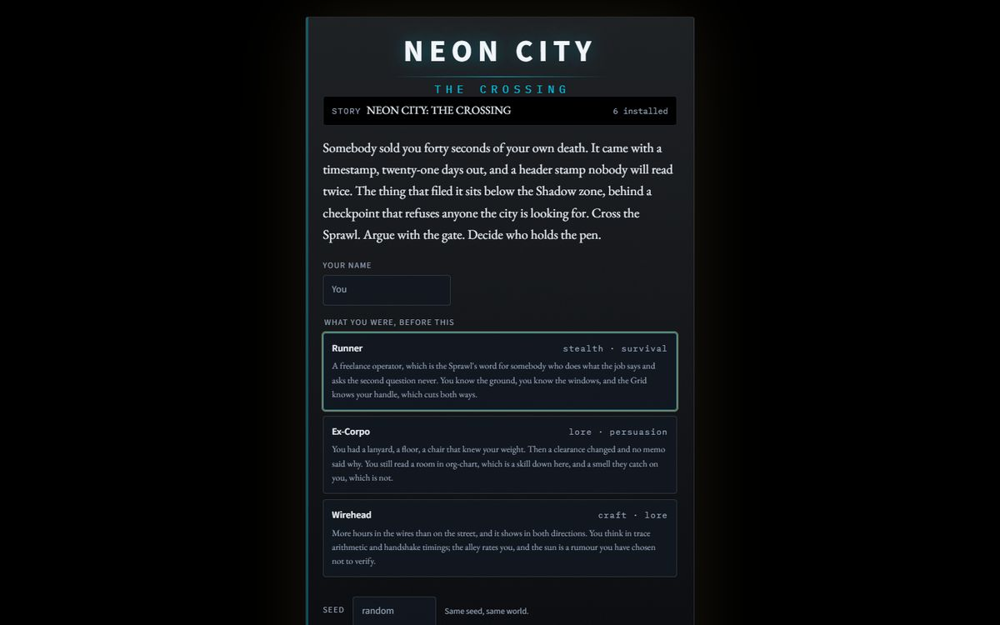 | 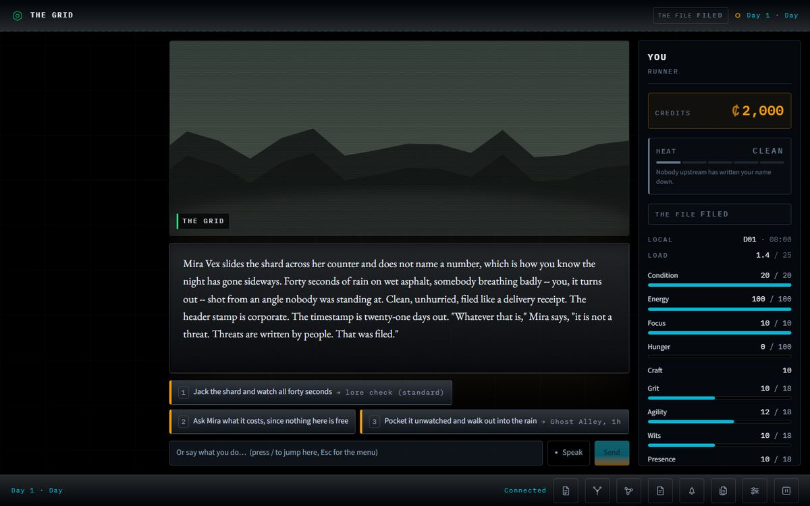 |

</details>

<details>
<summary><b>THE LONG CON</b></summary>

Two rooms over a laundry, your brother's name still on the glass. Eight places
with hours on every road. When the **frame** clock fills, it forces
**the interview**, an authored interrogation deck, in the middle of the open
city. The cast is narrated rather than run as agents: this story ships no
`agents.yaml`. No plates ship; the procedural silhouette suits it.

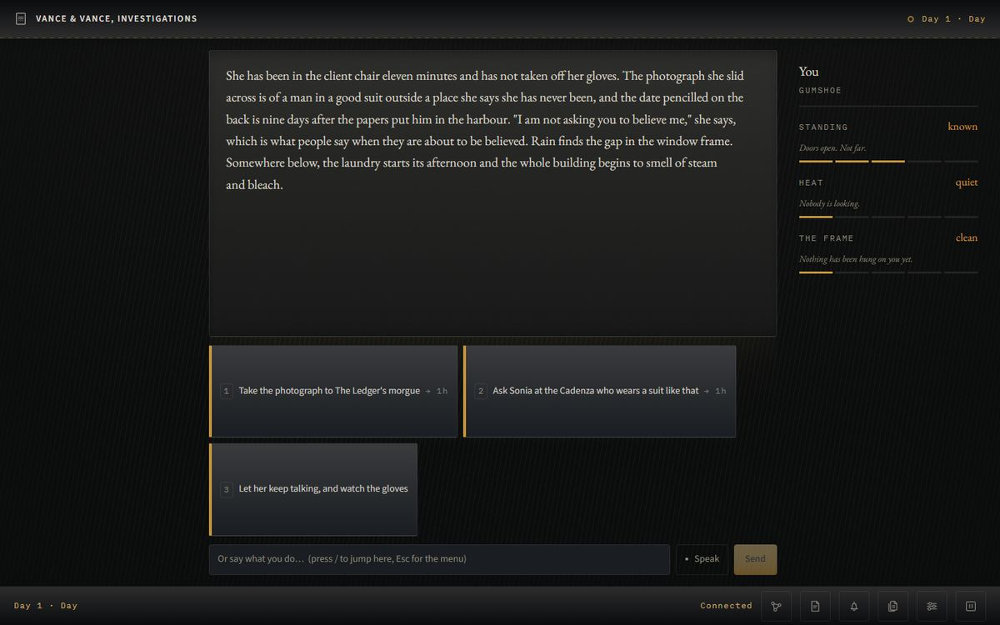

</details>

<details>
<summary><b>HUE & CRY</b>, in progress toward v1.0.0</summary>

You step off the barge at Tallowmere, a Lantern of the Watch shouts "the
Magpie!", and the whole city agrees. Today it has:

- **The Law.** Three watch-houses, wanted bands, guises, stops (run, talk,
  bribe, surrender or fight), and arrest.
- **Premises.** Thirty-one houses per run, each with a household that keeps
  real hours, security by tier, loot and one secret. Plus pockets, fences and
  hot goods.
- **Jobs.** `burgle` a house stage by stage: casing earns prep, flashbacks
  spend it, and an alarm brings the Watch.
- **Agendas.** A thief chosen by the seed robs the city under the Magpie's
  name, Captain Ardane hunts, and Silas Crook works the guild. All of it is
  authored and deterministic; no model plans it.
- **A living city.** Beds and bread, scrounging, honest work, night streets,
  luck on natural 20s and 1s, seven factions, a lore corpus, and three secret
  places to find.

One ending ships today (`honest_after_all`); the rest land across v0.15 to
v1.0. It runs on the engine's default skin for now, and no art plates ship
yet. Its bespoke screens are on the roadmap.

| In play: the casing board beside the opening | The map |
|---|---|
| 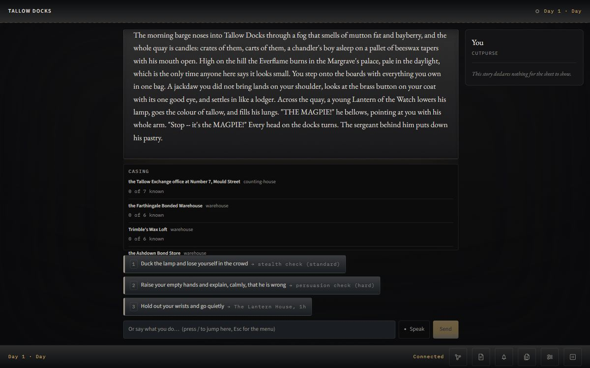 | 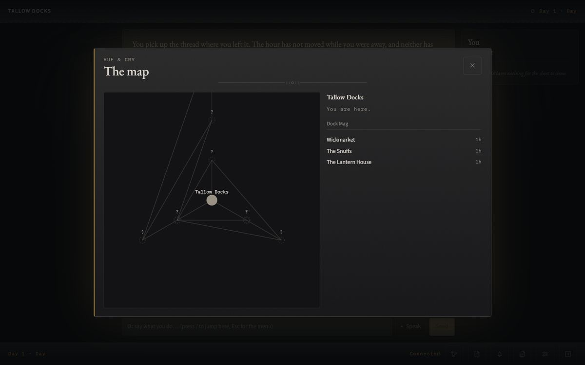 |

</details>

<details>
<summary><b>Dev Story</b>, the bench</summary>

A sandbox that ships so every per-story test has a row that shares almost
nothing with the big stories. It demonstrates the difference between an
**NPC** (a row in a schedule, which costs nothing) and an **agent** (a persona
with permissions that plans and negotiates, and costs one model call per turn).
It uses the engine's default skin, which is the generic sheet drawn from
declared meters and clocks.

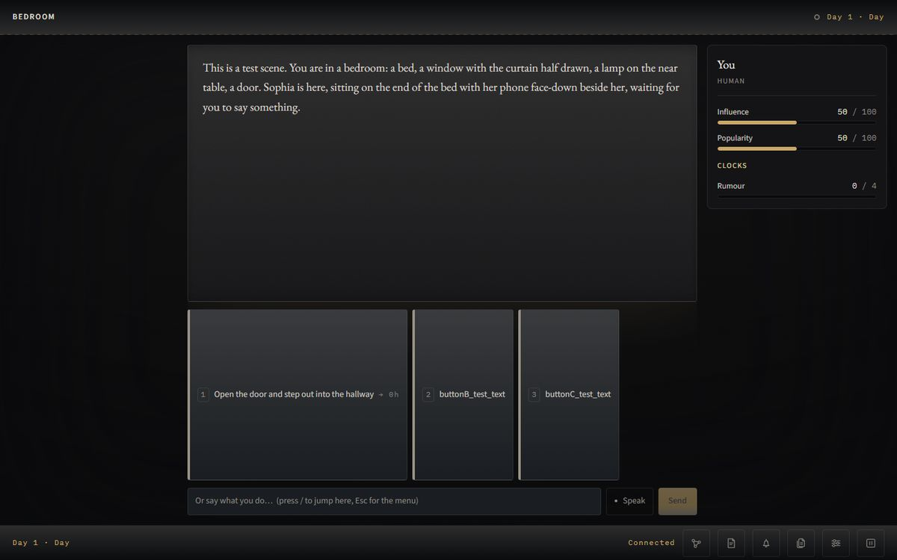

</details>

> **About the screenshots.** The UI screenshots are real captures from the
> v0.15.0 development branch. They were taken with no model server running,
> so they show opening frames, the map and one engine-resolved move, with no
> generated narration. The wide strips are the committed art plates.

---

## Features

<details open>
<summary><b>World and simulation</b></summary>

- **One world clock.** In-game hours advance only through
  `clock.advance_time`, charged as the cost of whatever spent them. A
  background tick drives world schedules.
- **Schedules and presence.** NPCs keep hour-by-hour schedules. Traders and
  caravans arrive on their own timetables. Who is present decides who can
  speak.
- **Procgen** villages and districts from a seed, with **secret places** that
  stay off the map until you find them.
- **Factions and reputation**, **gossip** that travels between venues, and
  **rumours** that improve as your awareness grows.
- **NPC agendas.** Authored schemes that move on the clock while you aren't
  looking (HUE & CRY).

</details>

<details>
<summary><b>Rules and resolution</b></summary>

- **Skill checks** against difficulty bands (`trivial` to `legendary`). The
  model names a band and the engine picks the DC.
- **Encounters as scenes**, not a combat subsystem, plus **death rules**
  declared per story.
- **Survival:** stamina, hunger and hp. **Rest is never gated**, because it is
  the only thing that restores stamina.
- **Economy and trade:** vendors, prices, fences, crafting and recipes,
  scavenging and forage tables, honest labour.
- **The Law:** watch-houses, wanted bands, guises, stops, bribes, arrest and
  custody.
- **Jobs and premises:** houses with households, security tiers and loot;
  staged burglaries with prep and flashbacks.
- **Boons and complications** on natural 20s and 1s.
- **One mutation path.** Quest rewards, boons, encounter outcomes and death all
  go through `effects.apply_effect`, so they are validated, clamped and
  receipted the same way.

</details>

<details>
<summary><b>Story structure</b></summary>

- **Graph stories:** locations, roads with hours and danger, quests with
  engine-evaluable stages.
- **Deck stories:** authored days and cards with gates and bands.
- **Hybrids:** a clock can **force** a deck scene in the middle of a graph.
- **Clocks** (progress clocks that fill and force scenes), **threads**
  (contracts with a lifecycle), **endings** with gates, and **epilogues**.
- **Declared state.** A story's `state.yaml` says what each value *is*
  (public, `veiled` or `hidden`). A hidden value never leaves the server, and
  a veiled one reaches the client only as a band word.

</details>

<details>
<summary><b>Narration and memory</b></summary>

- **Structured output.** The Storyteller's turn is a per-turn JSON Schema
  (narration, 2 or more choices, voiced NPCs, ledger updates). When a small
  model ignores schemas, a brace-counting fallback parser keeps turns alive.
- **Evaluator quality gate** with one retry. A rejected draft's side effects
  are rolled back first.
- **Governance rules** audit every resolved turn.
- **StoryLedger memory:** facts with decay and salience, NPC dispositions,
  promises with expiry, a rolling summary, and a token budget with a fixed
  eviction order. Stable prompt blocks come first, so the KV cache survives
  between turns.
- **RAG lore.** Each story's lore corpus is indexed into SQLite FTS and scored
  against the same chunks the model saw.
- **Continuity guard** and **subject memory**: characters remember what you
  said and what you owe.

</details>

<details>
<summary><b>Authoring</b></summary>

- `scripts/new_story.py` scaffolds a story from three templates (`minimal`,
  `graph`, `deck`). A fresh scaffold validates clean and gets every per-story
  test row.
- `scripts/validate_content.py` and `scripts/doctor.py` check content before
  you play it.
- `scripts/author.py` runs an AI-assisted drafting loop that feeds validator
  errors back to the model.
- **The studio:** `launcher.py --studio` edits stories in the browser, with
  live validation and a review queue.
- **Balance harnesses** that run headless, with no LLM: `scripts/simulate.py`
  for the flagship, and one per HUE & CRY system (law, jobs, agendas,
  scrounging, labour, streets).
- `scripts/art_missing.py` and `scripts/generate_art.py` list missing plates
  and fill them ahead of time.

</details>

---

## How the engine works

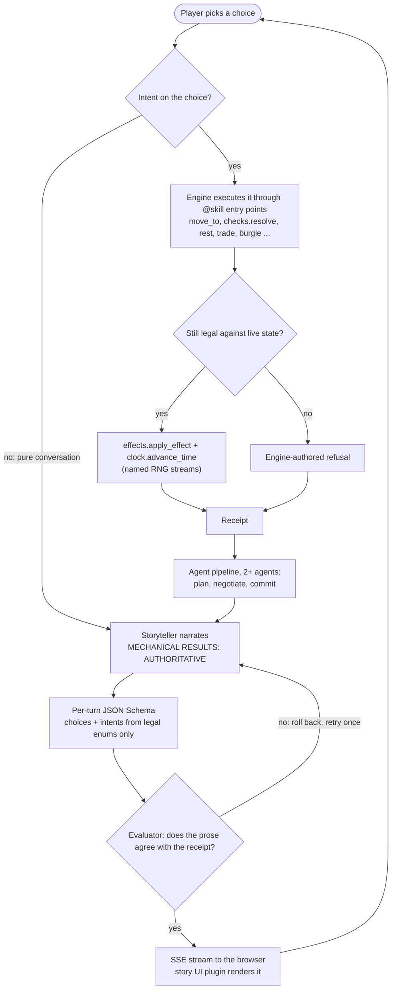

**Turn loop.** The player picks a choice, and `resolve_player_intent` reads its
`intent`. `run_turn` executes it *before anything plans or narrates*. Legality
is checked again at execution time, because the world may have moved since the
choice was offered. The receipt goes into the narrator's prompt as
authoritative. Quest evaluation, the ledger and autosave follow each turn.

**Intents** (`engine/game/intents.py`). `legal_intents` builds a catalogue each
turn from what the engine will accept in the current state. The schema has one
branch per verb, discriminated by a `const` action, so `{"action": "travel",
"target": "persuasion"}` isn't valid grammar. A choice with no mechanical
consequence declares no intent. The turn grammar forbids `tool_calls`; the
choice itself is how a turn changes the world.

**Agents.** A story's `agents.yaml` is a roster: which voices each agent owns,
what it may read, and what it may write (optionally only with a reason). With
two or more agents, every turn runs **plan, negotiate, commit**
(`engine/agents/pipeline.py`) before the narrator writes. The flagship's pair
is the Storyteller and the Assistant. The Assistant is an in-world companion
with trust, forms and hints, and it never sees the raw evil clock. A story can
also ship no roster and narrate its whole cast.

**Plugin UI.** The client is Vite + React 18. The core owns the frame (header,
narrative log, choices and compose box, footer toolbar) and is playable on its
own; the `_engine` default skin draws a generic sheet from the story's declared
meters. A story can add a plugin under `ui/src/stories/<plugin>/` that fills
named slots: an aside, a stage, a ledger, overlays. Four stories ship their
own plugin (`clockwork-dark`, `wicked-garden`, `neon-city`, `the-long-con`);
HUE & CRY and Dev Story use `_engine`. The build is committed, so playing
needs no Node.

**Saves** are atomic JSON with backup recovery and a forward migration chain.
They are namespaced per story under `data/saves/<slug>/`.

The full design is in [docs/DESIGN.md](docs/DESIGN.md) (mechanics,
architecture, anti-hallucination rules) and
[docs/DESIGN_REVIEW.md](docs/DESIGN_REVIEW.md) (what the overhauls found and
fixed).

---

## Getting started

Windows is the supported platform today.

### Requirements

| | |
|---|---|
| **Python** | 3.11 or newer (developed and tested on 3.11.9) |
| **LM Studio** | serving at `http://localhost:1234/v1` with a chat model loaded. Without it the game still runs, but the Storyteller falls back to a canned line and the UI says it can't reach it |
| **Node** | only to rebuild the client. The built UI is committed |
| **GPU services** | all optional and all **off by default** (see below) |

### Setup

```powershell
git clone https://github.com/nihilistau/clockwork-dark.git
cd clockwork-dark
.\scripts\start.ps1
```

`scripts/start.ps1` creates `.venv` if it's missing, installs
`requirements.txt`, and runs the test suite. It doesn't start the game;
picking a story is your call. To do the same steps by hand:

```powershell
python -m venv .venv
.\.venv\Scripts\python.exe -m pip install -r requirements.txt
```

**LM Studio API key.** If LM Studio's "Require API key" toggle is on, put the
key in `lmstudio.txt` at the repository root. The file is gitignored.
`config/default.yaml` reads it through `${file:lmstudio.txt}` and falls back to
the `LMSTUDIO_API_KEY` environment variable. If the toggle is on and neither is
set, every request fails with a 401 and the Storyteller falls back to its
canned line.

**Machine-specific paths** go in `config/local.yaml`, which is gitignored and
deep-merged over the defaults. Don't edit `config/default.yaml` for this.

```yaml
stack:
  services:
    voxtral_tts:
      root: "/path/to/voxtral-mini-realtime-rs"
```

### Check it

```powershell
.\.venv\Scripts\python.exe scripts\doctor.py     # environment, config, content, data integrity
.\.venv\Scripts\python.exe launcher.py --check   # which local services are up, and what each outage costs
.\.venv\Scripts\python.exe -m pytest tests\ -q   # expect fully green, no xfail
```

### Play

```powershell
.\.venv\Scripts\python.exe launcher.py --game clockwork-dark
# open http://localhost:5573
```

| Command | Effect |
|---|---|
| `launcher.py` | Play the default story, and warn about anything that's down |
| `launcher.py --game <slug>` | Play a specific story |
| `launcher.py --list-games` | List installed stories, with any manifest problems |
| `launcher.py --stack` | Start the managed local services, wait for health, then play |
| `launcher.py --check` | Print the service status table and exit |
| `launcher.py --no-stack` | Skip the service check entirely |
| `launcher.py --studio` | Serve the authoring studio alongside the game (`/?studio=1`) |
| `launcher.py --port N --host H` | Override the port (default 5573, from `config/default.yaml`) and bind host |

The story is chosen by `--game`, then the `CLOCKWORK_GAME` environment
variable, then `game.default` in `config/default.yaml`.

<details>
<summary><b>Optional local services</b> (all off by default, each for a measured reason)</summary>

| Service | Config key | Default | Why |
|---|---|---|---|
| Live image generation | `media.live_generation` | **off** | A Grok Imagine still takes 2 to 3 minutes, which can't sit inside a real-time turn. Use `scripts/generate_art.py` to fill gaps ahead of time |
| ComfyUI `:8188` | `comfyui.enabled` | **off** | Takes seconds rather than minutes, so it's the backend worth turning live generation on for |
| Spoken narration | `tts.enabled` | **off** | Measured at about 21x slower than realtime on the reference machine |
| Assistant voice only | `tts.assistant_enabled` | **off** | The companion's 1 to 3 sentence lines are the only thing worth speaking live |
| Push-to-talk | `stt.provider` | `faster_whisper` | Hold the mic button. The transcript lands in the box as editable text and never auto-submits. Runs in-process and needs `faster-whisper`, which `requirements.txt` installs |

With all of it off you still get streamed narration, dice receipts, scene art
from the shipped packs, encounters, quests and saves.

</details>

<details>
<summary><b>First-run extras, rebuilding the client, balance harnesses</b></summary>

```powershell
.\.venv\Scripts\python.exe scripts\seed_lore.py       # index a story's lore for RAG
.\.venv\Scripts\python.exe scripts\generate_art.py    # pre-generate art for gaps in the shipped pack
```

**The client** is Vite + React 18 in `ui/`, built into
`content/scenes/clockwork/static/dist`. That output is **committed on purpose**,
and the suite fails if it falls behind its source.

```powershell
npm ci --prefix ui
npm test --prefix ui          # the client tests: plugins, reducer, veiled rule
npm run build --prefix ui     # rebuild, then commit dist in the same change
```

**Balance.** Headless, no LLM. Run these before changing a balance constant.

```powershell
.\.venv\Scripts\python.exe scripts\simulate.py --policy all --turns 200 --seed 42   # flagship: baker, cautious, hero, pauper, reckless
.\.venv\Scripts\python.exe scripts\simulate_law.py       # HUE & CRY: careful | reckless | briber
.\.venv\Scripts\python.exe scripts\simulate_jobs.py      # blind | careful | greedy | greedy_bare
.\.venv\Scripts\python.exe scripts\simulate_agendas.py   # idle | careful | reckless
.\.venv\Scripts\python.exe scripts\simulate_scrounge.py  # scrounger | mornings
.\.venv\Scripts\python.exe scripts\simulate_labour.py    # porter | dipper | careful | scrounger
.\.venv\Scripts\python.exe scripts\simulate_streets.py   # wanderer: a street an hour, day and night
```

The HUE & CRY harnesses run 40 seeds of in-game days each. `--set KEY=VALUE`
tries a number without editing the file, and `--json` prints the raw table.
NEON CITY's and THE LONG CON's numbers are authored judgement and haven't been
simulated; their READMEs say so.

</details>

---

## Roadmap

Everything below is **planned, not built**. The order is fixed; details may
change as each release lands.

| Release | What | State |
|---|---|---|
| v0.15.0 | **Guild economy** for HUE & CRY: crafting, the Magpie's Hoard, blackmail and fence-credit threads, Brask's gate | in progress |
| v0.16.0 | **Acts I and II**: arcs, the initiation and interrogation decks, the Magpie reveal, the alibi beat | planned |
| v0.17.0 | **Act III and eight endings**: the Hanging Fair, the jailbreak, The Rope, per-ending tests | planned |
| v0.18.0 | **A thief policy** for `simulate.py` | planned |
| v0.19.0 | **Model-server agnostic**: LM Studio plus vLLM, the llama.cpp server, Ollama and other OpenAI-compatible backends | planned |
| v0.20.0 | **Linux as a first-class platform**, and a **hosted, web-served mode**: auth, per-user sessions and saves, a production server, Docker | planned |
| v0.21.0 | **UI/UX overhaul**, together with HUE & CRY's screens: wanted poster, job panel, casing board, portraits | planned |
| v1.0.0 | **HUE & CRY finished**: a thief mistaken for the Magpie in Tallowmere, eight endings, its art pack, live-played | planned |

Until those land, the engine talks to LM Studio, Windows is the supported
platform, and the game is a local single-player server. Known gaps are written
down, not implied. They're in CLAUDE.md's "Deliberately deferred" list and the
**NOT WIRED** tables in [docs/GOVERNANCE.md](docs/GOVERNANCE.md),
[docs/STATE.md](docs/STATE.md) and [docs/AGENTS.md](docs/AGENTS.md).

---

## Documentation

| Document | Audience | Purpose |
|---|---|---|
| [CHANGELOG.md](CHANGELOG.md) | Everyone | What changed in each release, and why. Authoritative from 0.4.0 |
| [docs/DESIGN.md](docs/DESIGN.md) | Architects | System design, story bible, mechanics, measured balance |
| [docs/DESIGN_REVIEW.md](docs/DESIGN_REVIEW.md) | Anyone picking this up | What the overhaul found, what it fixed, what's still open |
| [docs/AUTHORING.md](docs/AUTHORING.md) | Story authors | Writing a story under `games/<slug>/` without reading engine source |
| [docs/AGENTS.md](docs/AGENTS.md) | Architects | The in-game agents: roster, plan, negotiate, commit |
| [docs/GOVERNANCE.md](docs/GOVERNANCE.md), [docs/STATE.md](docs/STATE.md) | Architects | What is wired, and the NOT WIRED tables |
| [docs/CLAUDE_CODE_BRIEF.md](docs/CLAUDE_CODE_BRIEF.md) | Coding agents | Build spec and golden rules; historical sections marked **CURRENT:** |
| [docs/CLAUDE_DESIGN_BRIEF.md](docs/CLAUDE_DESIGN_BRIEF.md) | Design agents | Art direction, UI, generation prompts, audio |
| [AGENTS.md](AGENTS.md) | Any coding agent | The operating rules for changing this repo, tool-neutral |
| [CLAUDE.md](CLAUDE.md) | Claude Code | Imports AGENTS.md, then current status and what's in flight |

Each story has its own notes: [dev-story](games/dev-story/README.md),
[neon-city](games/neon-city/README.md), [the-long-con](games/the-long-con/README.md),
[hue-and-cry](games/hue-and-cry/README.md). When documents disagree, the code
wins, then DESIGN.md.

## Parent projects

Built by merging patterns from:

- [Archives of Anubis](https://github.com/nihilistau/Achieves-Of-Anubis): hard engine, narrative council, RAG lore
- [CosySim](https://github.com/nihilistau/CosySim): AgentGovernor, `@skill` tools, SSE tags, dual-agent scenes
