# The Clockwork Dark

[](https://github.com/nihilistau/clockwork-dark/actions/workflows/ci.yml)

**An emergent-story engine for local AI.** A deterministic engine holds the
truth: time, dice, money, law, what the city's schemers did last night. Local
LLM agents only narrate it. Seeded systems run into each other, the engine
settles the result, and a model on your own machine writes the prose.

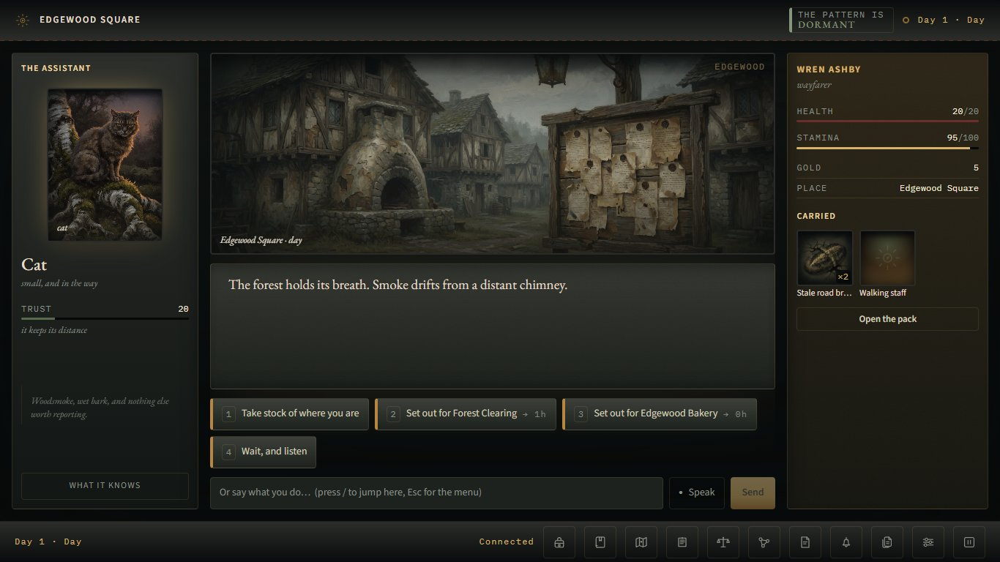

- **The engine resolves, the LLM narrates.** A choice that moves, spends or
  risks anything carries a structured `intent`. The engine runs it *before* the
  next word is written, and the model is handed the receipt as authoritative
  input. It is never asked to invent an outcome.
- **Illegal actions can't be sampled.** The output grammar is a JSON Schema
  built fresh every turn from what the engine will actually accept: the roads
  leaving *this* place, the NPCs *in the room*, the goods *this* vendor sells
  that you can afford. An unreachable destination is not in the enum.
- **Seeds replay.** Each system draws from its own named RNG stream, and world
  time moves only through one function. The same seed and the same choices
  give the same world, and adding a new dice roll doesn't shift the caravan
  schedule.
- **Every mechanic reaches the prose.** A mechanic the narrator can't mention
  would feel like a random event, so the suite checks three things: is each
  mechanic called, does the narration hear about it, and does the prose agree
  with the receipt. An evaluator rejects success narrated over a failed check,
  and a refused move produces an engine-written refusal rather than silence.
- **Local-first.** It runs against a model server on your own hardware --
  LM Studio by default, or llama.cpp's `llama-server`, Ollama, vLLM or any
  other OpenAI-compatible server. Image
  generation, voice and ComfyUI are optional and **off by default**. The
  shipped art packs mean scenes have pictures without any of them. Serving
  it to other people, with accounts, is opt-in (hosted mode).

**Status:** **v0.21.0** is the current release. Six stories ship, and each
can be played to an ending; HUE & CRY can be finished eight ways. The engine
is model-server agnostic: LM Studio stays the default, and llama-server,
Ollama, vLLM and generic OpenAI-compatible servers narrate too
([docs/MODEL_SERVERS.md](docs/MODEL_SERVERS.md) says which facts about each
were verified live; vLLM was, in v0.20.0). Since v0.20.0 **Linux** is a
first-class platform beside Windows, and an opt-in **hosted mode** serves
your stories to a small group with accounts, an admin panel and a Docker
image ([docs/HOSTING.md](docs/HOSTING.md)). Since v0.21.0 the play screen is
built from shared engine panels (wanted poster, job panel, casing board,
people, encounter, rolls), holds its layout from a phone to a desktop, and
reconnects by itself. At v0.21.0 the suite stood at 5977 passing, 24 skipped
on Windows, plus 462 client tests. Those numbers are re-measured each
release in [CLAUDE.md](CLAUDE.md), and [CHANGELOG.md](CHANGELOG.md) records
every change from 0.4.0 on.

---

## Contents

- [The stories](#the-stories)
- [Features](#features)
- [How the engine works](#how-the-engine-works)
- [Getting started](#getting-started)
- [Roadmap](#roadmap)
- [Documentation](#documentation)

---

## The stories

The engine doesn't know any of these stories exist. Each one is a directory
under `games/<slug>/` with a manifest (`game.yaml`) that declares which systems
it uses. **A story pays nothing for a system it doesn't declare, and the test
suite checks that its turns stay byte-identical.** Pick one with
`launcher.py --game <slug>`. Each story keeps its own `README.md` and
`CHANGELOG.md` beside its manifest (linked under [Documentation](#documentation));
this file and the root [CHANGELOG.md](CHANGELOG.md) cover the engine and the
release.

| Story | Slug | Genre and register | Leans on | What sets it apart |
|---|---|---|---|---|
| **The Clockwork Dark** | `clockwork-dark` | Grounded low fantasy. A frontier village, and something brass winding outward from the Wound | Travel graph, survival, crafting, encounters, awareness-gated arcs, the evil clock, death rules | The flagship. The evil advances whether you become a hero or a baker, and the quiet life counts as a complete game |
| **The Wicked Garden** | `wicked-garden` | Fae-court bargain. One day in the garden costs ten at home | Scene decks, veiled meters, clocks, threads, many endings | The deck exemplar, with no HP, no hunger, no skill checks and nothing to buy. It shows the engine isn't one game with the nouns swapped |
| **NEON CITY: THE CROSSING** | `neon-city` | Cyberpunk survival expedition across the Sprawl on a 21-day timestamp | Graph world, scavenge economy, a doom-style clock that quests can make *slip*, debt escalation, threads, six ending classes | A graph story with no evil clock. The pressure comes from heat, debt, the weather and the file |
| **THE LONG CON** | `the-long-con` | Rain-and-radiator noir. A client, a photograph, a man already dead | Graph city with road encounters, a shop, and a clock that forces an authored deck scene | The first hybrid: a walkable city with a set-piece deck inside it. It also has secret places, a clue board, gossip, and a continuity guard that rejects a scene greeting someone you know as a stranger |
| **HUE & CRY** | `hue-and-cry` | Wry, warm thief's comedy with real gallows. Tallowmere, a candle-port, where everyone has decided you are the Magpie | Premises, the Law, jobs and flashbacks, NPC agendas, survival, labour, factions, lore, a guild economy (crafting, a collectable set, blackmail, credit), Acts I–III (the Magpie's trail, an alibi and an accusation, the Hanging Fair, a jailbreak), death with a respawn, and eight endings | The systems-heavy one, finishable eight ways, and still in progress toward v1.0.0 (screens, art, live play). The world schemes, robs and hunts on its own clock |
| **Dev Story** | `dev-story` | Not a game: the annotated bench. A house, a university and eight people | One small working instance of every subsystem, plus the multi-agent pipeline | The worked example the story templates are distilled from. Change one thing and see what it does |

<details open>
<summary><b>The Clockwork Dark</b>, the flagship</summary>

You wake at the forest's edge beside Edgewood, the last comfortable village
before the Marches. The **evil clock** ticks through `dormant`, `stirring`,
`spreading` and `consuming` whatever you do. Four story arcs (quiet life,
whisper, march, convergence) open on **awareness**, a hidden stat, so a baker
who never listens to the caravan master stays a baker. It has 25 quests,
survival with rest that is never gated, crafting and recipes, trade, encounters
played as scenes rather than a combat system, death rules, and an in-world
companion (the Assistant) whose trust you earn. It has the largest shipped art
pack and its own UI plugin.

| Title screen | The map |
|---|---|
| 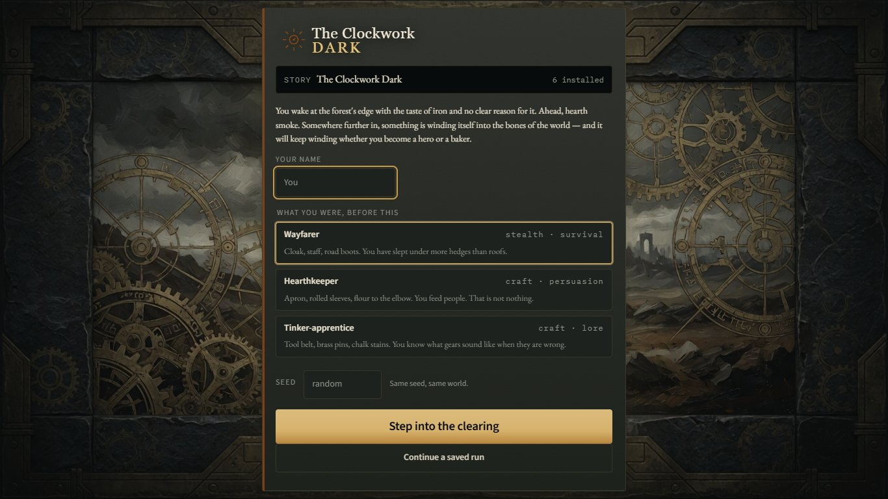 | 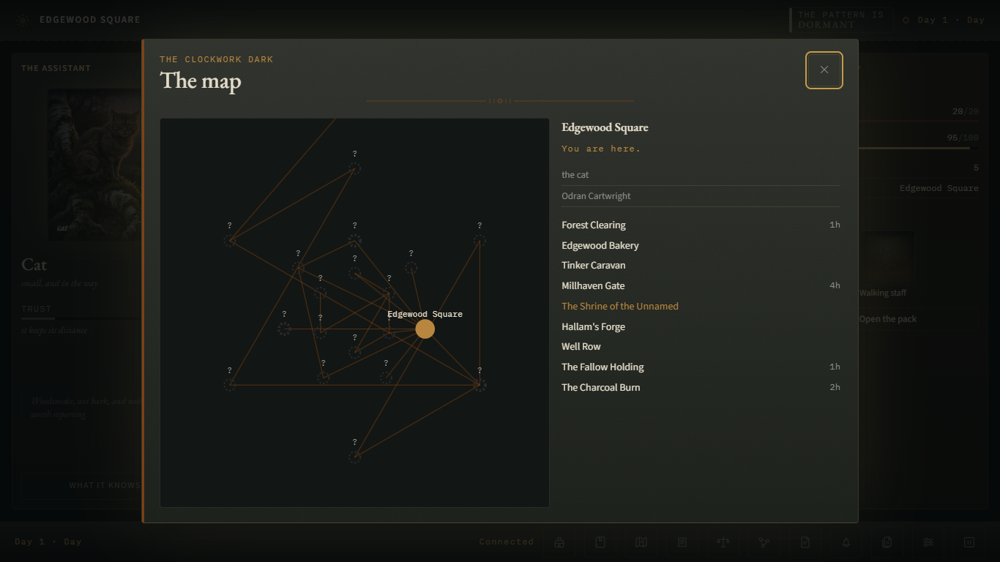 |


</details>

<details>
<summary><b>The Wicked Garden</b>, the deck exemplar</summary>

A garden between worlds, and a High Fae who has decided she wants you. Play
runs through authored **scene decks**: days, cards, gates and bands. **Time
debt** charges ten mortal days for each one spent inside. Its meters are
**veiled**: the client gets a band word ("closed", "loose", "cool") and never
the number, and the test suite enforces that. It has two pipeline agents (a GM
and Sophia), each kept away from the other's secrets.

| Opening | A deck card, after stepping through the gate |
|---|---|
| 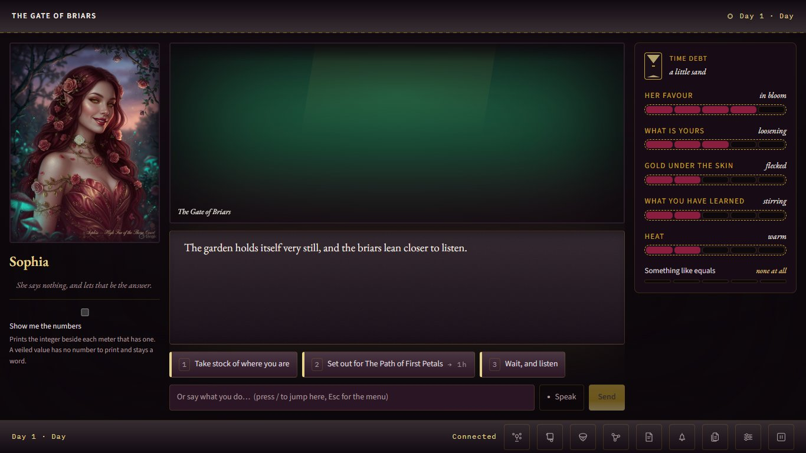 | 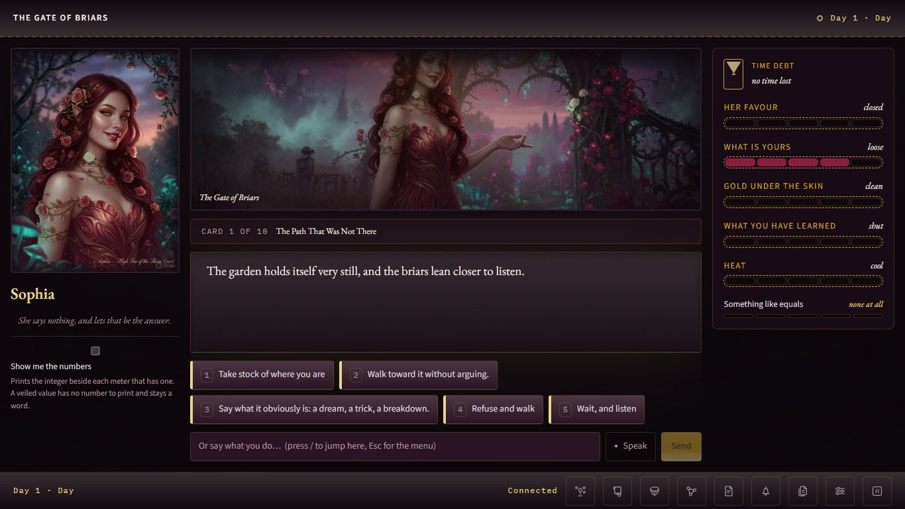 |


</details>

<details>
<summary><b>NEON CITY: THE CROSSING</b></summary>

Somebody sold you forty seconds of your own death, with a timestamp 21 days
out. Fourteen locations across four altitudes, 22 quests in four arcs, forage
tables per district, vendors and jobs. The **timestamp** clock winds down one
segment a day and quests make it slip back. **Collections** escalates your
debt. Threads track the Sprawl's contracts. It has its own UI plugin with a
heat ladder and credits. No art plates ship yet, so scenes use the procedural
silhouette.

| Title screen | In play |
|---|---|
| 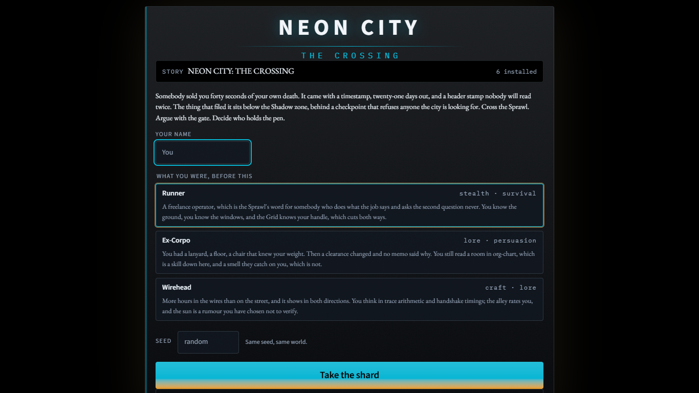 | 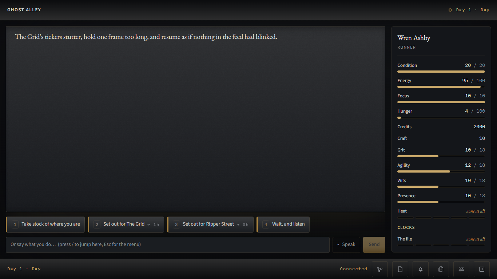 |

</details>

<details>
<summary><b>THE LONG CON</b></summary>

Two rooms over a laundry, your brother's name still on the glass. Eight places
with hours on every road. When the **frame** clock fills, it forces
**the interview**, an authored interrogation deck, in the middle of the open
city. The cast is narrated rather than run as agents: this story ships no
`agents.yaml`. No plates ship; the procedural silhouette suits it.

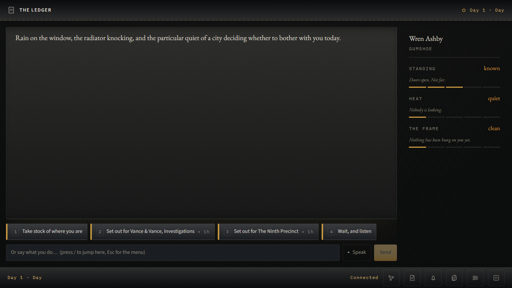

</details>

<details>
<summary><b>HUE & CRY</b>, finishable in eight ways, in progress toward v1.0.0</summary>

You step off the barge at Tallowmere, a Lantern of the Watch shouts "the
Magpie!", and the whole city agrees. Today it has:

- **The Law.** Three watch-houses, wanted bands, guises, stops (run, talk,
  bribe, surrender or fight), and arrest.
- **Premises.** Thirty-one houses per run, each with a household that keeps
  real hours, security by tier, loot and one secret. Plus pockets, fences and
  hot goods.
- **Jobs.** `burgle` a house stage by stage: casing earns prep, flashbacks
  spend it, and an alarm brings the Watch.
- **Agendas.** A thief chosen by the seed robs the city under the Magpie's
  name, Captain Ardane hunts, and Silas Crook works the guild. All of it is
  authored and deterministic; no model plans it.
- **A living city.** Beds and bread, scrounging, honest work, night streets,
  luck on natural 20s and 1s, seven factions, a lore corpus, and three secret
  places to find.
- **A guild economy.** A bench at the Porters' Hall where the `craft` verb
  files lockpicks, rolls smoke pellets, cuts a lamplighter's coat (a new
  guise) and forges a Margrave's Hill gate pass, from makings bought off the
  fences or found in the gutters. **The Magpie's Hoard**, six famous pieces
  the ballad says were never fenced, is a collectable set that pays once
  when all six are carried. A secret carried out of a job is *held*, and
  the secrets of four fixed premises (the Captain's Office, the Treasury,
  Vessaline House, Mother Gannet's) open **blackmail** threads, with teeth if
  left uncollected. The two fences stand **credit**; a welsher finds neither
  will buy from them, and collectors on the streets. Since v0.18 the fences
  pay about half a hot haul's worth, so **burglary pays**: measured over 14
  days, a fencing burglar keeps 7 days fed and roofed where a purses-only
  pickpocket keeps 4, and an honest porter, the safe road, 13.
- **Acts I and II.** The barge opening's three choices are real (run, talk,
  or come quietly into an arrest). The Honest Company swears you in through
  an initiation deck, and the oath opens Act II. Every arrest ends in the
  Lantern House's small room, an interrogation deck that can change your
  file but never your sentence. The seed hides **the Magpie's trail** in the
  city's houses, eight clues of which only some point true, so burglary is
  also the investigation. At the Lantern House front desk the Watch's own
  duty book is your **alibi** for the nights the Magpie robbed while you sat
  in a cell, and with two clues that agree (not necessarily truly) you can **name the Magpie** to
  the captain: rightly, and the Watch stops taking you for the Magpie;
  wrongly, and it costs you.

- **Act III: the Hanging Fair.** On days 10 to 12 the fair comes to Gallows
  Green: the ballad, the Showing of the Flame, and the Everflame's heart on
  the palace steps, to watch or to steal (a severe stealth roll). A thief the
  Watch was already holding when the fair came is walked down to the gallows
  on its last morning, unless the fine is paid or the cells are broken out
  of first: **the jailbreak** is two skill gauntlets, about one try in
  three, and one try a day.
- **Death, and a way on.** At hp 0 you wake on the step of Old Nance's
  flophouse, half a purse lighter (still held, if the Watch held you). Only
  a death in the cells while the fair is on ends the story.
- **Eight endings**, each through its own door and each earned: **Cleared**
  (name the real Magpie, and see the Watch take them at the fair), **A
  Lantern** (the captain's badge), **Honest After All** (the evening barge,
  for a thief who never stole), **Partners** (throw in with the Magpie and
  take the heart together), **The Legend** (take the heart alone and get it
  home), **Guildmaster** (Mother Gannet's needles), **The Dapper's City**
  (Silas Crook's rise), and **The Rope**, the fail-forward, told like a Quest
  for Glory death screen. `tests/test_finales.py` drives every one through
  its door, and `scripts/simulate_endings.py` measures which policy reaches
  which.

Since v0.21.0 it wears its own skin (tallow and soot, parchment panels) over
the engine's panels: the wanted poster, the job panel, the casing board, the
people here, the watch stop's approaches and the roll card. No art plates or
portraits ship yet: its art pack and live play are on the roadmap.

| In play: the opening at the Lantern House | The map |
|---|---|
| 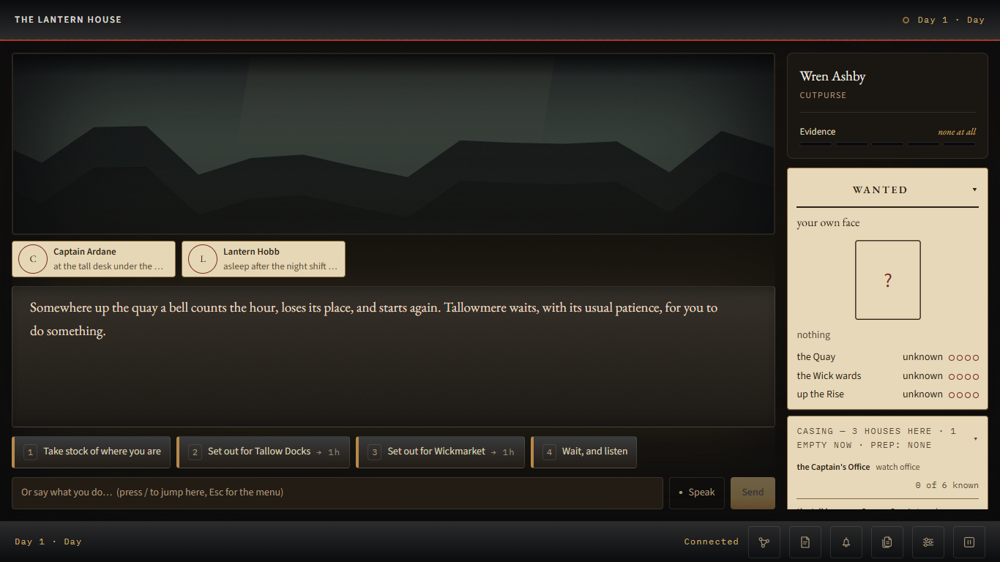 | 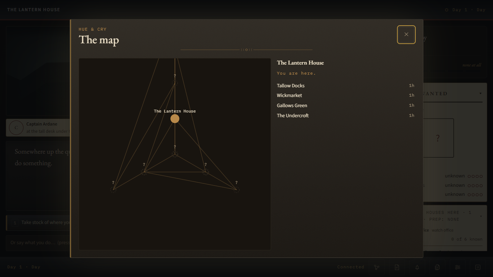 |

| A job under way: the job panel, the wanted poster and the casing board | The same on a phone (390 x 844) |
|---|---|
| 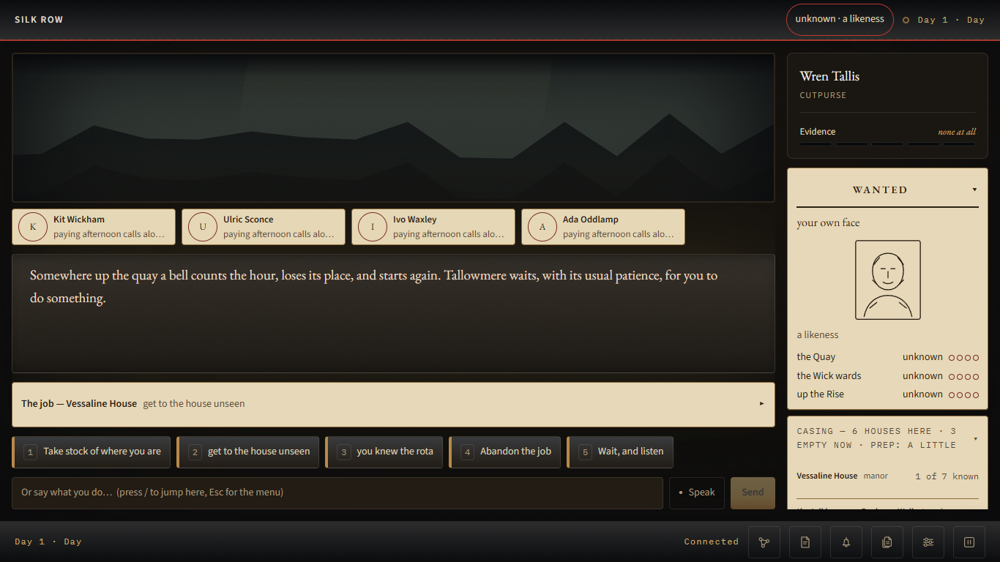 | 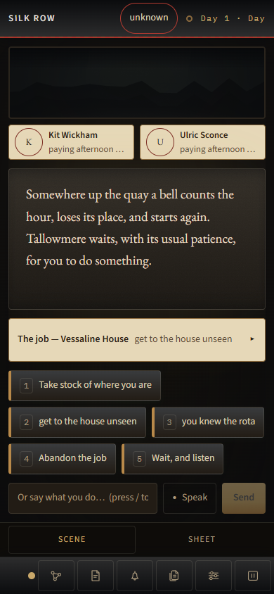 |

</details>

<details>
<summary><b>Dev Story</b>, the bench</summary>

A sandbox that ships so every per-story test has a row that shares almost
nothing with the big stories. It demonstrates the difference between an
**NPC** (a row in a schedule, which costs nothing) and an **agent** (a persona
with permissions that plans and negotiates, and costs one model call per turn).
It uses the engine's default skin, which is the generic sheet drawn from
declared meters and clocks.

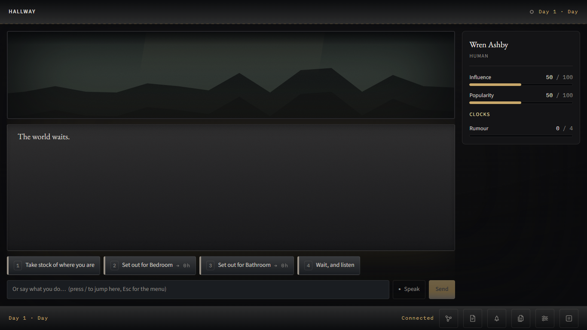

</details>

> **About the screenshots.** The UI screenshots are real captures from the
> v0.21.0 release, taken at 1366x768 (the phone view at 390x844) with no model
> server running: every narration line is the story's own fallback narration,
> the words a player sees when the model is down, and every move shown was one
> the engine offered. The wide strips are the committed art plates. They can be
> retaken with `scripts/screenshot_runs.py` (builds the runs in a fresh root,
> and serves a story over them with `--serve`, no model) and
> `npm run screenshots --prefix ui` (the captures, through the browser already
> installed). The four plate-heavy captures are JPEG (quality 85), the rest PNG.

---

## Features

<details open>
<summary><b>World and simulation</b></summary>

- **One world clock.** In-game hours advance only through
  `clock.advance_time`, charged as the cost of whatever spent them. A
  background tick drives world schedules.
- **Schedules and presence.** NPCs keep hour-by-hour schedules. Traders and
  caravans arrive on their own timetables. Who is present decides who can
  speak.
- **Procgen** villages and districts from a seed, with **secret places** that
  stay off the map until you find them.
- **Factions and reputation**, **gossip** that travels between venues, and
  **rumours** that improve as your awareness grows.
- **NPC agendas.** Authored schemes that move on the clock while you aren't
  looking, and a masked role's **trail** of clues the seed lays through the
  generated houses, for the player to read (HUE & CRY).

</details>

<details>
<summary><b>Rules and resolution</b></summary>

- **Skill checks** against difficulty bands (`trivial` to `legendary`). The
  model names a band and the engine picks the DC.
- **Encounters as scenes**, not a combat subsystem, plus **death rules**
  declared per story.
- **Survival:** stamina, hunger and hp. **Rest is never gated**, because it is
  the only thing that restores stamina.
- **Economy and trade:** vendors, prices, fences, scavenging and forage
  tables, honest labour, and collectable sets that pay when completed.
- **Crafting:** a `craft` verb in any story that declares recipes, offered
  only when a recipe can actually be made right there (station, tools and
  inputs in hand).
- **The Law:** watch-houses, wanted bands, guises, stops, bribes, arrest and
  custody.
- **Jobs and premises:** houses with households, security tiers and loot;
  staged burglaries with prep and flashbacks.
- **Boons and complications** on natural 20s and 1s.
- **One mutation path.** Quest rewards, boons, encounter outcomes and death all
  go through `effects.apply_effect`, so they are validated, clamped and
  receipted the same way.

</details>

<details>
<summary><b>Story structure</b></summary>

- **Graph stories:** locations, roads with hours and danger, quests with
  engine-evaluable stages.
- **Deck stories:** authored days and cards with gates and bands.
- **Hybrids:** a clock can **force** a deck scene in the middle of a graph.
- **Clocks** (progress clocks that fill and force scenes), **threads**
  (contracts, bribes, blackmail and repeatable lines of credit, with a
  lifecycle and consequences when broken), **endings** with gates, and
  **epilogues**.
- **Declared state.** A story's `state.yaml` says what each value *is*
  (public, `veiled` or `hidden`). A hidden value never leaves the server, and
  a veiled one reaches the client only as a band word.

</details>

<details>
<summary><b>The play screen</b></summary>

- **Engine panels.** Shared surfaces are drawn by the engine, not rebuilt by
  each story: the **wanted poster** and its header chip, the **job panel**, the
  **casing board**, the **people here** (a stranger is a silhouette until
  met), the **encounter's approaches**, the **roll card** and the
  **negotiation panel**. A story turns them on in its manifest (`ui.panels`,
  [docs/AUTHORING.md](docs/AUTHORING.md) section 2.5); a plugin that draws one
  itself says so (`ownsPanels`).
- **A layout that holds.** The centre column is a grid of named areas: the
  shelf of panels is capped and scrolls inside itself, so nothing paints over
  the choices, on a desktop or a phone (`npm run layout-check --prefix ui`).
- **A connection that recovers.** A dropped socket is retried with backoff and
  the page rejoins its run, recovering a turn that finished meanwhile; a
  hosted player whose run opened in another window, or was ended by an admin,
  is told why and offered Play here or Resume.

</details>

<details>
<summary><b>Narration and memory</b></summary>

- **Structured output.** The Storyteller's turn is a per-turn JSON Schema
  (narration, 2 or more choices, voiced NPCs, ledger updates). When a small
  model ignores schemas, a brace-counting fallback parser keeps turns alive.
- **Any model server.** One table (`engine/llm/providers.py`) says how each
  server takes a grammar, turns thinking off, reports its models and answers
  a health check: LM Studio, llama-server, Ollama (its native `/api/chat`, so
  the context is set per request), vLLM and generic OpenAI-compatible
  servers. The grammar is probed once and falls back a rung at a time, with
  the schema sent as text when no grammar is on the wire; every reply is
  conformed to what the engine offered; thinking a server leaves in the
  answer is moved out before the player or the tag scanner sees it; a turn
  starved by thinking is retried once, grammar kept. The doctor names the
  server and what it found ([docs/MODEL_SERVERS.md](docs/MODEL_SERVERS.md)).
- **Evaluator quality gate** with one retry. A rejected draft's side effects
  are rolled back first.
- **Governance rules** audit every resolved turn.
- **StoryLedger memory:** facts with decay and salience, NPC dispositions,
  promises with expiry, a rolling summary, and a token budget with a fixed
  eviction order. Stable prompt blocks come first, so the KV cache survives
  between turns.
- **RAG lore.** Each story's lore corpus is indexed into SQLite FTS and scored
  against the same chunks the model saw.
- **Continuity guard** and **subject memory**: characters remember what you
  said and what you owe.

</details>

<details>
<summary><b>Authoring</b></summary>

- `scripts/new_story.py` scaffolds a story from three templates (`minimal`,
  `graph`, `deck`). A fresh scaffold validates clean and gets every per-story
  test row.
- `scripts/validate_content.py` and `scripts/doctor.py` check content before
  you play it.
- `scripts/author.py` runs an AI-assisted drafting loop that feeds validator
  errors back to the model.
- **The studio:** `launcher.py --studio` edits stories in the browser, with
  live validation and a review queue.
- **Balance harnesses** that run headless, with no LLM: `scripts/simulate.py`
  for the flagship and (`--game hue-and-cry`) HUE & CRY's thief,
  `scripts/simulate_decks.py` for deck stories, and one per HUE & CRY system
  (law, jobs, agendas, scrounging, labour, streets, the Hoard, the Acts, the
  endings).
- `scripts/art_missing.py` and `scripts/generate_art.py` list missing plates
  and fill them ahead of time.

</details>

<details>
<summary><b>Platforms and hosting</b></summary>

- **Windows and Linux.** Every script has a PowerShell and a POSIX way in
  (`scripts/start.ps1`, `scripts/start.sh`), the content's paths are checked
  for case and separators on every platform, one `constraints.txt` pins the
  versions the suite was proven green on, and the suite runs green in a
  Linux container. CI (GitHub Actions on Ubuntu) runs the suite, the client
  and the Docker build.
- **Local single-player by default**, on `127.0.0.1` with no login. One line
  opens it to your LAN.
- **Hosted mode** (opt-in, `hosting.enabled`): accounts you make
  (`scripts/users.py`), a login on every route and socket event, every run
  and save owned by one account, one live run per player, and one model
  server shared fairly -- one first-come queue for every story, a turn
  admitted before anything in it runs, limits on actions, input and
  connections.
- **A supervisor and a front door.** One worker process per story, health
  checks, crash restarts, drained start/stop/restart; players reach one
  port, log in once and pick a story, and the front door proxies HTTP and
  relays the game's WebSocket to it. On Linux every process runs under
  gunicorn.
- **An admin panel** at `/admin`: users (one-time passwords, roles,
  disable, delete), live sessions, saves (metadata only), stories, the
  model server's settings (applied by draining and restarting each story,
  rolled back on failure), the queue, metrics and errors. It shows how the
  service runs and never what was played, and every change is written
  first to an audit log.
- **Docker.** One image, one container, every story you list, as a
  non-root user with its data on a `/data` volume and no secret baked in;
  Compose publishes it on the host's loopback for a TLS proxy to front, and
  can run a vLLM server beside it.

</details>

---

## How the engine works

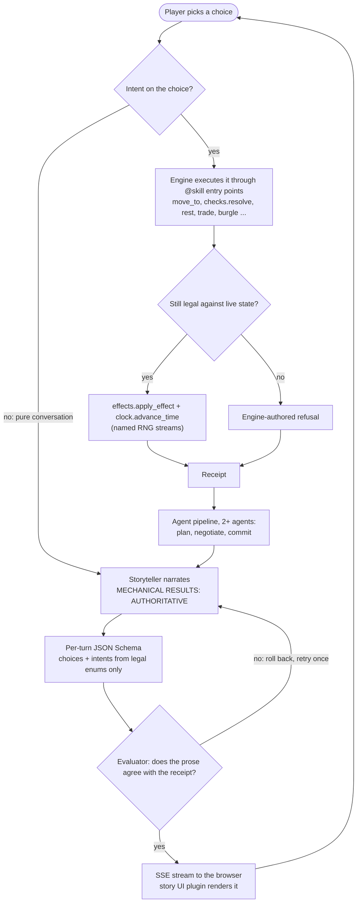
```mermaid
flowchart TD
    P([Player picks a choice]) --> I{Intent on the choice?}
    I -- "no: pure conversation" --> N
    I -- yes --> X["Engine executes it through @skill entry points<br/>move_to, checks.resolve, rest, trade, burgle ..."]
    X --> L{Still legal against live state?}
    L -- no --> R[Engine-authored refusal]
    L -- yes --> E["effects.apply_effect + clock.advance_time<br/>(named RNG streams)"]
    E --> RC[Receipt]
    R --> RC
    RC --> A["Agent pipeline, 2+ agents:<br/>plan, negotiate, commit"]
    A --> N["Storyteller narrates<br/>MECHANICAL RESULTS: AUTHORITATIVE"]
    N --> S["Per-turn JSON Schema<br/>choices + intents from legal enums only"]
    S --> V{Evaluator: does the prose agree with the receipt?}
    V -- "no: roll back, retry once" --> N
    V -- yes --> O["SSE stream to the browser<br/>story UI plugin renders it"]
    O --> P
```

**Turn loop.** The player picks a choice, and `resolve_player_intent` reads its
`intent`. `run_turn` executes it *before anything plans or narrates*. Legality
is checked again at execution time, because the world may have moved since the
choice was offered. The receipt goes into the narrator's prompt as
authoritative. Quest evaluation, the ledger and autosave follow each turn.

**Intents** (`engine/game/intents.py`). `legal_intents` builds a catalogue each
turn from what the engine will accept in the current state. The schema has one
branch per verb, discriminated by a `const` action, so `{"action": "travel",
"target": "persuasion"}` isn't valid grammar. A choice with no mechanical
consequence declares no intent. The turn grammar forbids `tool_calls`, and
narration executes none on any config: a server with no grammar has its
reply conformed to the turn's schema, dropping any choice whose intent the
engine did not offer. The choice itself is how a turn changes the world.

**Agents.** A story's `agents.yaml` is a roster: which voices each agent owns,
what it may read, and what it may write (optionally only with a reason). With
two or more agents, every turn runs **plan, negotiate, commit**
(`engine/agents/pipeline.py`) before the narrator writes. The flagship's pair
is the Storyteller and the Assistant. The Assistant is an in-world companion
with trust, forms and hints, and it never sees the raw evil clock. A story can
also ship no roster and narrate its whole cast.

**Plugin UI.** The client is Vite + React 18. The core owns the frame (header,
narrative log, choices and compose box, footer toolbar) and is playable on its
own; the `_engine` default skin draws a generic sheet from the story's declared
meters. A story can add a plugin under `ui/src/stories/<plugin>/` that fills
named slots: an aside, a stage, a ledger, overlays; the engine's own panels
(the wanted poster, the job panel and the rest) are declared in the manifest,
not slots. Five stories ship their
own plugin (`clockwork-dark`, `wicked-garden`, `neon-city`, `the-long-con`,
and HUE & CRY's, a skin over the engine's panels that fills no slot); Dev
Story uses `_engine`. The build is committed, so playing
needs no Node.

**Saves** are atomic JSON with backup recovery and a forward migration chain.
They are namespaced per story under `data/saves/<slug>/`: the engine writes
everything it makes at run time (saves, generated images, narration audio)
under one storage root, `storage.root` in `config/default.yaml` (`data`,
taken against the repository, not the working directory), which
`config/local.yaml` or the `CLOCKWORK_DATA_DIR` environment variable can move.
A story no longer declares `paths.saves`, and since v0.21.0 a `paths.saves`
in `config/local.yaml` stops the game at startup with a message naming the
file and the fix (set `storage.root` instead).

The full design is in [docs/DESIGN.md](docs/DESIGN.md) (mechanics,
architecture, anti-hallucination rules) and
[docs/DESIGN_REVIEW.md](docs/DESIGN_REVIEW.md) (what the overhauls found and
fixed).

---

## Getting started

Windows and Linux are both supported (since v0.20.0): every command below has
a PowerShell spelling and a POSIX `sh` one, and the suite is run on Linux in a
`python:3.11-slim-bookworm` container ([docs/HOSTING.md § Linux](docs/HOSTING.md#linux)).
Other POSIX systems, macOS included, should work but are untested.

### Requirements

| | |
|---|---|
| **Python** | 3.11 or newer (developed and tested on 3.11.9) |
| **A model server** | LM Studio by default, serving at `http://localhost:1234/v1` with a chat model loaded -- or llama-server, Ollama, vLLM or another OpenAI-compatible server (**Model server**, below). Without one the game still runs, but the Storyteller falls back to a canned line and the UI says it can't reach the model server |
| **Node** | only to rebuild the client. The built UI is committed |
| **GPU services** | all optional and all **off by default** (see below) |

### Setup

Windows (PowerShell):

```powershell
git clone https://github.com/nihilistau/clockwork-dark.git
cd clockwork-dark
.\scripts\start.ps1
```

Linux (POSIX `sh`):

```sh
git clone https://github.com/nihilistau/clockwork-dark.git
cd clockwork-dark
./scripts/start.sh
```

Each start script creates `.venv` if it's missing (`start.sh` wants
`python3.11`, or a `python3` that is 3.11 or newer), installs
`requirements.txt` under `constraints.txt`, and runs the test suite. It
doesn't start the game; picking a story is your call. To do the same steps by
hand:

```powershell
python -m venv .venv
.\.venv\Scripts\python.exe -m pip install -r requirements.txt -c constraints.txt
```

```sh
python3.11 -m venv .venv
.venv/bin/python -m pip install -r requirements.txt -c constraints.txt
```

`requirements.txt` says which versions the code supports; `constraints.txt`
pins the ones the suite was proven green on, so install with both.

**Model server.** LM Studio is the default, and needs nothing in
`config/local.yaml`: start its server (Developer tab, port 1234) and load a
model. If its "Require API key" toggle is on, put the key in
`llm_api_key.txt` at the repository root (gitignored). `llm.api_key` tries, in
order, `llm_api_key.txt`, `lmstudio.txt` (the name before v0.19.0, still read),
and the `CLOCKWORK_LLM_API_KEY` and `LMSTUDIO_API_KEY` environment variables;
the first one that holds a value wins. The two LM Studio-named sources,
`lmstudio.txt` and `LMSTUDIO_API_KEY`, are read only while `llm.provider` is
`lmstudio`, so LM Studio's key is never sent to another server. If the toggle is on and none is set,
every request fails with a 401 and the Storyteller falls back to its canned
line.

Any other server is named in `config/local.yaml`:

| Server | Start it | `config/local.yaml` |
|---|---|---|
| llama.cpp `llama-server` (run live, b7966) | `llama-server -m model.gguf --port 8080 -c 16384 --jinja` | `llm: {provider: llamacpp, base_url: "http://localhost:8080/v1", profiles: {big: {model: "model.gguf"}, small: {model: "model.gguf"}}}` |
| Ollama (run live, 0.34.4) | `ollama serve` (the desktop app runs it for you; the portable build does not), then `ollama pull qwen3:4b` -- which thinks before every narration turn (MODEL_SERVERS § Ollama) | `llm: {provider: ollama, base_url: "http://localhost:11434", profiles: {big: {model: "qwen3:4b"}, small: {model: "qwen3:4b"}}}` |
| vLLM (run live, 0.31.0, its Docker image) | `vllm serve <model> --reasoning-parser <parser>`, or on Windows the `vllm/vllm-openai` image (`--dtype half` on a Turing card; MODEL_SERVERS § vLLM) | `llm: {provider: vllm, base_url: "http://localhost:8000/v1", profiles: {big: {model: "Qwen/Qwen3-1.7B"}, small: {model: "Qwen/Qwen3-1.7B"}}}` |
| Any OpenAI-compatible server | per the server | `llm: {provider: openai_compat, base_url: "<its /v1 base>"}` |

A key a server was started with (`--api-key`) goes in `llm_api_key.txt`, the
`CLOCKWORK_LLM_API_KEY` environment variable, or `llm.api_key` in
`config/local.yaml`; `lmstudio.txt` and `LMSTUDIO_API_KEY` are not read for
any server but LM Studio.
Every server gets the strongest structured output it proves it can enforce,
and is health-checked on its own routes; the MCP tool loop (`llm.mcp`, off by
default) stays LM Studio's alone. The flags each server needs, what the
engine knows about it and what was measured live, turning reasoning off, and
how to declare what a server does not report are in
[docs/MODEL_SERVERS.md](docs/MODEL_SERVERS.md).

**Your model settings** live under `llm:` in `config/local.yaml`. A
`local.yaml` written before v0.19.0 says `lmstudio:` instead; since v0.21.0
the game refuses to start with it, naming the file and the fix: rename the
block `llm:` (and `ttl_seconds` inside it `keep_alive_seconds`).

**The in-game Settings panel writes `config/local.yaml` too.** A save rewrites
the whole file: every key in it is kept, but its comments are not. A
`local.yaml` that does not parse is never overwritten; the panel says so and
saves nothing until you fix it.

**Machine-specific paths** go in `config/local.yaml`, which is gitignored and
deep-merged over the defaults. Don't edit `config/default.yaml` for this.

**A config file outside the repo** can be named in the `CLOCKWORK_CONFIG`
environment variable (several, joined by `;` on Windows or `:` elsewhere,
the last winning). It merges over `config/local.yaml`, so the Settings panel
cannot change a key it sets: a save says which keys it shadowed, and the
doctor lists the file's keys (never their values). A named file that is
missing or does not parse stops the game from starting, naming the file.

```yaml
stack:
  services:
    voxtral_tts:
      root: "/path/to/voxtral-mini-realtime-rs"
```

### Check it

```powershell
.\.venv\Scripts\python.exe scripts\doctor.py     # environment, config, content, data integrity
.\.venv\Scripts\python.exe launcher.py --check   # which local services are up, and what each outage costs
.\.venv\Scripts\python.exe -m pytest tests\ -q   # expect fully green, no xfail
```

```sh
.venv/bin/python scripts/doctor.py
.venv/bin/python launcher.py --check
.venv/bin/python -m pytest tests/ -q
```

The doctor's model-server section is named after the configured server
(`LM Studio`, or `Model server (vllm)` and so on) and asks it the way a turn
does: is it up (on that server's own health routes), is the model bound, does
a short completion come back, and -- off LM Studio -- whether reasoning can be
turned off, which structured-output rung turns use, and whether the server
puts its thinking inside the answer. The model server is the one service
whose outage is a FAIL: `launcher.py --check` exits 1 when it is down. The
rows are listed in
[docs/MODEL_SERVERS.md § Health checks](docs/MODEL_SERVERS.md#health-checks-and-what-the-doctor-says).

The suite never talks to a model server and never touches your
`config/local.yaml`, saves or LM Studio `mcp.json`, in child processes as
well as its own: every script it runs gets a sandbox config pointing at the
discard port and a temp directory. The same suite, the client's tests and
build, and the Docker image's build and health check run in CI on Linux (`.github/workflows/ci.yml`, GitHub Actions,
no secrets needed); the status badge at the top of this file is its
latest run on `main`.

### Play

```powershell
.\.venv\Scripts\python.exe launcher.py --game clockwork-dark
# open http://localhost:5573
```

```sh
.venv/bin/python launcher.py --game clockwork-dark
# open http://localhost:5573
```

| Command | Effect |
|---|---|
| `launcher.py` | Play the default story, and warn about anything that's down |
| `launcher.py --game <slug>` | Play a specific story |
| `launcher.py --list-games` | List installed stories, with any manifest problems |
| `launcher.py --stack` | Start the managed local services, wait for health, then play |
| `launcher.py --check` | Print the service status table and exit (1 if the model server is down) |
| `launcher.py --no-stack` | Skip the service check entirely |
| `launcher.py --studio` | Serve the authoring studio alongside the game (`/?studio=1`) |
| `launcher.py --port N --host H` | Override the port (default 5573, from `config/default.yaml`) and bind host |

The story is chosen by `--game`, then the `CLOCKWORK_GAME` environment
variable, then `game.default` in `config/default.yaml`.

**The game listens on this machine only** (`127.0.0.1`) by default, since
v0.20.0: local mode has no login, so anyone who could reach it could play,
load and delete your runs. To play from another device on your network, put
one line in `config/local.yaml`:

```yaml
scene: {clockwork: {host: "0.0.0.0"}}
```

(or start it with `launcher.py --host 0.0.0.0`). The launcher and
`scripts/doctor.py` then warn that the game is reachable with no login. To
share it with other people, with accounts, use hosted mode (**Host it for
others**, below).

The game also answers only to the names it is served under: `localhost`,
`127.0.0.1`, `[::1]` and the host it binds (on a `0.0.0.0` bind, any IP
address and this machine's name). A request for any other Host gets a 400, so
a web page that points its own domain at your machine (DNS rebinding) cannot
drive the game. And a page on another site cannot change anything either: a
POST (or any other request that is not GET, HEAD or OPTIONS) whose `Origin`
or `Referer` names another site gets a 403, and so does any request to
`/socket.io/` or WebSocket upgrade whose `Origin` does. "Another site" means
another HOST: a page on `localhost` or `127.0.0.1` at a different port (a
local dev server, say) counts as the same site, as it does for the browser.

<details>
<summary><b>Optional local services</b> (all off by default, each for a measured reason)</summary>

| Service | Config key | Default | Why |
|---|---|---|---|
| Live image generation | `media.live_generation` | **off** | A Grok Imagine still takes 2 to 3 minutes, which can't sit inside a real-time turn. Use `scripts/generate_art.py` to fill gaps ahead of time |
| ComfyUI `:8188` | `comfyui.enabled` | **off** | Takes seconds rather than minutes, so it's the backend worth turning live generation on for |
| Spoken narration | `tts.enabled` | **off** | Measured at about 21x slower than realtime on the reference machine |
| Assistant voice only | `tts.assistant_enabled` | **off** | The companion's 1 to 3 sentence lines are the only thing worth speaking live |
| Push-to-talk | `stt.provider` | `faster_whisper` | Hold the mic button. The transcript lands in the box as editable text and never auto-submits. Runs in-process and needs `faster-whisper`, which `requirements.txt` installs |

With all of it off you still get streamed narration, dice receipts, scene art
from the shipped packs, encounters, quests and saves.

</details>

<details>
<summary><b>First-run extras, rebuilding the client, balance harnesses</b></summary>

```powershell
.\.venv\Scripts\python.exe scripts\seed_lore.py       # index a story's lore for RAG
.\.venv\Scripts\python.exe scripts\generate_art.py    # pre-generate art for gaps in the shipped pack
```

```sh
.venv/bin/python scripts/seed_lore.py
.venv/bin/python scripts/generate_art.py
```

**The client** is Vite + React 18 in `ui/`, built into
`content/scenes/clockwork/static/dist`. That output is **committed on purpose**,
and the suite fails if it falls behind its source.

```sh
npm ci --prefix ui
npm test --prefix ui          # the client tests: plugins, reducer, veiled rule
npm run build --prefix ui     # rebuild, then commit dist in the same change
```

These three are the same in PowerShell and `sh`. The layout gate
(`npm run layout-check --prefix ui`) and the README's captures
(`npm run screenshots --prefix ui`) drive an installed Chrome against a
running game; AGENTS.md's "The client" says how.

**Balance.** Headless, no LLM. Run these before changing a balance constant.

```powershell
.\.venv\Scripts\python.exe scripts\simulate.py --policy all --turns 200 --seed 42   # flagship: baker, cautious, hero, pauper, reckless
.\.venv\Scripts\python.exe scripts\simulate.py --game hue-and-cry   # HUE & CRY's thief, in one report (--policy thief|thieves|living|all|<endings policy>, --seeds, --days, --json)
.\.venv\Scripts\python.exe scripts\simulate_law.py       # HUE & CRY: careful | reckless | briber
.\.venv\Scripts\python.exe scripts\simulate_jobs.py      # blind | careful | greedy | greedy_bare
.\.venv\Scripts\python.exe scripts\simulate_agendas.py   # idle | careful | reckless
.\.venv\Scripts\python.exe scripts\simulate_scrounge.py  # scrounger | mornings
.\.venv\Scripts\python.exe scripts\simulate_labour.py    # porter | dipper | careful | scrounger | careful_pell | careful_marrow | careful_porter | burglar | burglar_pell | burglar_marrow (--bed, --no-credit)
.\.venv\Scripts\python.exe scripts\simulate_streets.py   # wanderer: a street an hour, day and night (--collectors)
.\.venv\Scripts\python.exe scripts\simulate_hoard.py     # hoarder: the anchors, the Hoard, the squeezes (--no-pass, --severity)
.\.venv\Scripts\python.exe scripts\simulate_acts.py      # investigator: Acts I-II, the trail and the reveal (--opening, --gate)
.\.venv\Scripts\python.exe scripts\simulate_endings.py   # eleven policies to the ending each run locks (--fair-day, --break-out)
```

```sh
.venv/bin/python scripts/simulate.py --policy all --turns 200 --seed 42
.venv/bin/python scripts/simulate.py --game hue-and-cry
.venv/bin/python scripts/simulate_law.py
.venv/bin/python scripts/simulate_jobs.py
.venv/bin/python scripts/simulate_agendas.py
.venv/bin/python scripts/simulate_scrounge.py
.venv/bin/python scripts/simulate_labour.py
.venv/bin/python scripts/simulate_streets.py
.venv/bin/python scripts/simulate_hoard.py
.venv/bin/python scripts/simulate_acts.py
.venv/bin/python scripts/simulate_endings.py
```

(The same flags as the PowerShell lines above.)

The HUE & CRY harnesses run 40 seeds of in-game days each, and none of them
writes a save. The law, jobs, agendas and acts harnesses take `--set KEY=VALUE`
to try a number without editing the file, and every one takes `--json` for the
raw table. `scripts/simulate.py --game hue-and-cry` puts them in one place:
it plays `scripts/simulate_endings.py`'s policies (`--policy thief`, the
default, is its heister) and reports each one's endings, wanted bands and
arrests, jobs carried out, clues, deaths and respawns, and gold, where the
city's agendas met the thief (`collisions`; `--policy thieves` plays the five
burglars they are measured over), with the days a thief keeps on its own coin from `scripts/simulate_labour.py`'s
careful pickpocket; `--policy living` plays that harness's thieves who pay their own way instead
(the fencing burglar, borrowing or not, and the careful pickpocket who takes a porter's shift when hungry).
`scripts/simulate_decks.py --game wicked-garden` walks a deck
story the same way: every ending, card and clock, over seeded runs.
NEON CITY's and THE LONG CON's numbers are authored judgement and haven't been
simulated; their READMEs say so, and `simulate.py --game` refuses them (and
Dev Story, the engine's test bench) until their overhauls, v0.25.0-v0.26.0.

</details>

### Host it for others

Hosted mode (since v0.20.0, off by default) serves your stories to a small
group you make accounts for. The quickest way is Docker, on the machine that
runs the model server:

```sh
docker build -t clockwork-dark .
docker compose up -d game
docker compose exec game python scripts/users.py add <you> --admin
```

Then open `http://localhost:5573` and log in; the panel is at `/admin`. Which
stories run is `hosting.stories` in `/data/config.yaml` inside the volume.
Compose publishes the port on the host's loopback only: for anyone else,
put a TLS reverse proxy in front (Caddy and nginx examples in
docs/HOSTING.md). The container reaches a model server on the host at
`host.docker.internal`; the cookie key and an API key come from the
environment or `/data`, never the image.

Without Docker, turn it on in `config/local.yaml` (or a file named by
`CLOCKWORK_CONFIG`), make the first admin, and start the supervisor:

```yaml
hosting:
  enabled: true
  stories: ["clockwork-dark", "hue-and-cry"]
```

```sh
.venv/bin/python -m pip install -r requirements-server.txt -c constraints.txt   # gunicorn, Linux
.venv/bin/python scripts/users.py add <you> --admin
.venv/bin/python launcher.py          # with hosting on, this runs the supervisor
```

The supervisor starts a worker per story and the front door on port 5573;
on Linux each runs under gunicorn, on Windows on the development server (a
trial, and the doctor says so). `scripts/users.py` makes, resets, disables
and removes accounts (and `adopt` moves your local runs into one), or an
admin does it in the panel. Hosted mode turns off what one player's machine
should not share: the Settings panel's save, the studio and the LM Studio
skills server. Everything else -- accounts, the reverse proxy, sizing the
model server's lanes, systemd, `/data` ownership, upgrading, and what the
operator can and cannot see -- is [docs/HOSTING.md](docs/HOSTING.md).

---

## Roadmap

Everything below the shipped row is **planned, not built**. The order is
fixed; details may change as each release lands.

| Release | What | State |
|---|---|---|
| v0.15.0 | **Guild economy** for HUE & CRY: crafting, the Magpie's Hoard, blackmail and fence-credit threads, Brask's gate | **shipped** |
| v0.16.0 | **Acts I and II** for HUE & CRY: the opening, the initiation and interrogation decks, the Magpie's trail, the reveal and the alibi | **shipped** |
| v0.17.0 | **Act III and eight endings**: the Hanging Fair, the jailbreak, The Rope, per-ending tests | **shipped** |
| v0.18.0 | **A thief policy** for `simulate.py`, agenda collisions and welshing's cost for a burglar measured, and the fences made to pay | **shipped** |
| v0.19.0 | **Model-server agnostic**: LM Studio plus vLLM, the llama.cpp server, Ollama and other OpenAI-compatible backends | **shipped** |
| v0.20.0 | **Linux as a first-class platform**, and a **hosted, web-served mode**: accounts and a login, per-account runs and saves, one model-server queue, a supervisor and front door, an admin panel, gunicorn, Docker; vLLM run live | **shipped** |
| v0.21.0 | **UI/UX overhaul**, together with HUE & CRY's screens: engine panels (wanted poster, job panel, casing board, people, encounter, rolls), a layout that holds, a connection that recovers, HUE & CRY's skin; the legacy aliases removed | **shipped** |
| v0.22.0 | **A new story: a dating simulation** played through a phone of apps -- dating apps, texts, voice and video messages, two-player games -- with a cast the engine runs and no endgame | next |
| v0.23.0 | **The Clockwork Dark overhaul** | planned |
| v0.24.0 | **The Wicked Garden overhaul** | planned |
| v0.25.0 | **NEON CITY overhaul** | planned |
| v0.26.0 | **THE LONG CON overhaul** | planned |
| v1.0.0 | **Every story finished**, each with its art and live play (Dev Story stays the engine's test bench) | planned |

Each overhaul gives a story HUE & CRY's full treatment: a design spec, its
story and characters, the engine systems apt to it, every ending reachable
and tested, measured balance, reviews, UI screens and art. A large story may
take two releases, which shifts the numbers after it.

Windows and Linux are both supported platforms. The game is a local
single-player server by default, and hosted mode serves it to a group with
accounts. Known gaps are written
down, not implied. They're in CLAUDE.md's "Deliberately deferred" list and the
**NOT WIRED** tables in [docs/GOVERNANCE.md](docs/GOVERNANCE.md),
[docs/STATE.md](docs/STATE.md) and [docs/AGENTS.md](docs/AGENTS.md).

---

## Documentation

| Document | Audience | Purpose |
|---|---|---|
| [CHANGELOG.md](CHANGELOG.md) | Everyone | What changed in the engine in each release, and why. Authoritative from 0.4.0 |
| `games/<slug>/CHANGELOG.md` | Everyone | What changed in one story's content, release by release (links below) |
| [docs/DESIGN.md](docs/DESIGN.md) | Architects | System design, story bible, mechanics, measured balance |
| [docs/DESIGN_REVIEW.md](docs/DESIGN_REVIEW.md) | Anyone picking this up | What the overhaul found, what it fixed, what's still open |
| [docs/AUTHORING.md](docs/AUTHORING.md) | Story authors | Writing a story under `games/<slug>/` without reading engine source |
| [docs/MODEL_SERVERS.md](docs/MODEL_SERVERS.md) | Anyone running the game | The model servers the engine speaks, what it knows about each, model discovery and declared models |
| [docs/HOSTING.md](docs/HOSTING.md) | Anyone running it on Linux, or for others | Linux as a platform (the start script, each optional service, the suite in a container); what hosted mode is and is not, and upgrading; its accounts and login (`scripts/users.py`), ownership, one live run per player, sharing the model server, the limits; the supervisor, its workers and the front door, the reverse proxy, gunicorn and systemd; the admin panel page by page, metrics, errors and the audit log, and what the operator can read; the Docker image and Compose; the config layers and the doctor's hosted rows; what hosted mode turns off |
| [docs/AGENTS.md](docs/AGENTS.md) | Architects | The in-game agents: roster, plan, negotiate, commit |
| [docs/GOVERNANCE.md](docs/GOVERNANCE.md), [docs/STATE.md](docs/STATE.md) | Architects | What is wired, and the NOT WIRED tables |
| [docs/CLAUDE_CODE_BRIEF.md](docs/CLAUDE_CODE_BRIEF.md) | Coding agents | Build spec and golden rules; historical sections marked **CURRENT:** |
| [docs/CLAUDE_DESIGN_BRIEF.md](docs/CLAUDE_DESIGN_BRIEF.md) | Design agents | Art direction, UI, generation prompts, audio |
| [AGENTS.md](AGENTS.md) | Any coding agent | The operating rules for changing this repo, tool-neutral |
| [CLAUDE.md](CLAUDE.md) | Claude Code | Imports AGENTS.md, then current status and what's in flight |

Each story has its own README and CHANGELOG:

| Story | README | CHANGELOG |
|---|---|---|
| The Clockwork Dark | [games/clockwork-dark/README.md](games/clockwork-dark/README.md) | [CHANGELOG](games/clockwork-dark/CHANGELOG.md) |
| The Wicked Garden | [games/wicked-garden/README.md](games/wicked-garden/README.md) | [CHANGELOG](games/wicked-garden/CHANGELOG.md) |
| NEON CITY: THE CROSSING | [games/neon-city/README.md](games/neon-city/README.md) | [CHANGELOG](games/neon-city/CHANGELOG.md) |
| THE LONG CON | [games/the-long-con/README.md](games/the-long-con/README.md) | [CHANGELOG](games/the-long-con/CHANGELOG.md) |
| HUE & CRY | [games/hue-and-cry/README.md](games/hue-and-cry/README.md) | [CHANGELOG](games/hue-and-cry/CHANGELOG.md) |
| Dev Story | [games/dev-story/README.md](games/dev-story/README.md) | [CHANGELOG](games/dev-story/CHANGELOG.md) |

When documents disagree, the code wins, then DESIGN.md.

## Parent projects

Built by merging patterns from:

- [Archives of Anubis](https://github.com/nihilistau/Achieves-Of-Anubis): hard engine, narrative council, RAG lore
- [CosySim](https://github.com/nihilistau/CosySim): AgentGovernor, `@skill` tools, SSE tags, dual-agent scenes
