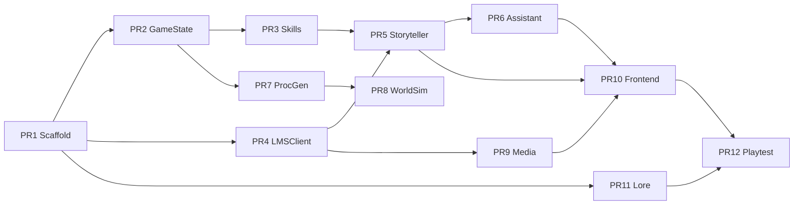

# The Clockwork Dark — Claude Code Implementation Brief

**Document type:** Agent onboarding + build specification  
**Audience:** Claude Code, Cursor, Grok, or any autonomous coding agent  
**Read first:** [DESIGN.md](DESIGN.md) for vision; this doc for *how to build*  
**Creative reference:** [CLAUDE_DESIGN_BRIEF.md](CLAUDE_DESIGN_BRIEF.md)  
**Version:** 0.2.0 — 2026-08-07

> **Status: the build is done.** PR1–PR12 shipped, and the overhaul phases
> P1–P11 corrected most of what they shipped. The scaffold, type sketches and
> API signatures below are **historical**: they describe what was originally
> specified, and several of them are no longer true. Every one that has drifted
> is annotated **CURRENT:** with what the code does now. Read the annotation,
> not the sketch.
>
> If you are here to change something, the authority order is: the code, then
> [DESIGN.md](DESIGN.md), then [DESIGN_REVIEW.md](DESIGN_REVIEW.md), then this
> file.

---

## §0 — CRITICAL: Agent Onboarding

If you are an AI agent operating on this repository, **read this section before writing code.**

### Golden Rules

1. **Engine resolves mechanics; LLMs narrate.** Never let the Storyteller change HP, inventory, or dice without a `@skill` tool call returning engine truth.
2. **Never hardcode ports, paths, or model names.** Use `get_config().get("dot.path", default)` from `config/default.yaml`.
3. **Reuse before reimplementing.** Grep this repo and the parent patterns from [CosySim](https://github.com/nihilistau/CosySim) and [Archives of Anubis](https://github.com/nihilistau/Achieves-Of-Anubis). Port, don't reinvent.
4. **Prove fixes with tests.** Do not declare success without passing output. Run `pytest` for touched modules.
5. **Windows-aware.** Use `scripts/start.ps1`, `.venv\Scripts\python.exe`, forward slashes OK in Python strings.
6. **LM Studio base:** `http://localhost:1234/v1` — do not deviate without config key.
7. **Scope discipline.** Implement only the PR(s) requested. No drive-by refactors.
8. **Log format:** `[module] Description (operation=X): detail` for observability.

### Golden rules added by the overhaul

9. **`clock.advance_time` is the only writer of world time.** `world_day`,
   `world_hour` and `time_of_day` are derived properties. If you find yourself
   wanting to set one, you want `advance_time`.
10. **`effects.apply_effect` is the only writer of game state.** Quest rewards,
    boons, complications, encounter outcomes and death all go through it.
    Mutating `state.stats` directly bypasses clamping, receipts and the ledger.
11. **Never use bare `random`.** Use `world_rng(state, STREAM)` from
    `engine/game/rng.py` with a named stream constant, so a seed replays and
    adding one roll does not shift another system's draws.
12. **A doc that describes a mechanism which does not run is a bug.** If you
    build something and do not wire it, say so in DESIGN.md with **NOT WIRED**
    and the file it lives in. `SceneRulesEngine` had a passing test suite, a
    design-doc guarantee, and no caller, for five PRs.
13. **Do not add a gate to rest.** Rest is the only thing that restores stamina.
    Any location or resource requirement on it rebuilds the soft-lock that
    `engine/game/survival.py` exists to fix. Downgrade, never refuse.
14. **New balance constants get a `scripts/simulate.py` run before they land.**
    Every number in this project was chosen against a clock that did not tick.

### Acknowledgment

After reading, tell the user: **"Onboarding complete. Awaiting orders."** — do not dump this document back at them.

### Parent repo patterns (mandatory study)

| Pattern | Source repo | Key file |
|---------|-------------|----------|
| Deterministic engine + event signal | Anubis | `src/game/engine.py`, `src/game/state.py` |
| Narrative council + evaluator retry | Anubis | `src/framework/council.py`, `src/agents/evaluator.py` |
| Dual-agent scene | CosySim | `content/scenes/realm/realm_scene.py` |
| `@skill` + dice/trade | CosySim | `content/scenes/tavern/tavern_skills.py` |
| SSE + StreamProcessor tags | CosySim | `engine/agents/stream_processor.py`, `engine/lmstudio/` |
| AgentGovernor + interceptors | CosySim | `engine/mcp/comms_framework.py` |
| ComfyUI generator | Anubis | `src/agents/comfyui_generator.py` or CosySim `engine/mcp/tools/media.py` |
| World tick | CosySim | `engine/world/world_sim.py` |
| RAG seed | Anubis | `scripts/seed_lore.py` |

---

## §1 — Repository Scaffold

**CURRENT.** The tree below is the original plan. What it gets wrong:
`engine/game/combat.py` does not exist and never will (conflict is a scene, not
a combat system — `engine/game/encounter.py`); `engine/agents/virtual_agent.py`
and `content/scenes/clockwork/clockwork_rules.py` do not exist; `engine/mcp/`
contains only `scene_rules_engine.py`, now run post-turn by `RulesGovernor`
(`engine/agents/governance.py`). What it omits:

```
engine/
├── game/          clock.py  rng.py  checks.py  effects.py  survival.py
│                  encounter.py  quests.py  transaction.py  reputation.py
├── memory/        ledger.py  context.py  budget.py  summarizer.py
├── persistence/   atomic.py  saves.py  migrations.py
├── media/providers/   shipped.py  grokbuild.py  procedural.py  base.py
├── world/         npc_sim.py  schedules.py  world_sim.py
├── agents/        json_stream.py  tag_buffer.py  tool_dispatcher.py
│                  **CURRENT:** pipeline.py  planner.py  plan.py  negotiate.py
│                  roster.py  knowledge.py  character.py — the multi-agent turn.
│                  `turn_loop.py` is retired to `.bak`; it never ran.
├── lmstudio/      schemas.py  tools.py  gate.py  speculative.py
├── skills/builtin/    mechanics.py  livelihood.py  items.py  assistant.py  quests.py
└── stack.py       service supervision for launcher.py --stack/--check

ui/                Vite + React 18 client; `npm run build` emits into
                   content/scenes/clockwork/static/dist, which is COMMITTED

data/              saves/  media/ — engine-owned runtime output ONLY.
                   **CURRENT:** the flagship's content (rules/ tables/
                   quests/<arc>/ encounters/ items/ recipes/ world/ art/
                   lore/ procgen_templates/) moved to
                   games/clockwork-dark/data/, the same layout every story uses.

scripts/           doctor.py  simulate.py  generate_art.py  seed_lore.py  start.ps1
```

```
clockwork-dark/
├── CLAUDE.md                      # Pointer to this file
├── pyproject.toml
├── requirements.txt
├── config/
│   ├── default.yaml               # Source of truth
│   ├── development.yaml
│   └── voices.yaml
├── docs/
│   ├── DESIGN.md
│   ├── CLAUDE_DESIGN_BRIEF.md
│   └── CLAUDE_CODE_BRIEF.md       # This file
├── data/                          # Runtime output only (saves/, media/).
│   └── saves/                     # JSON game saves, per game slug
│                                  # **CURRENT:** story content (lore/, recipes/,
│                                  # procgen_templates/, ...) lives under
│                                  # games/<slug>/data/ — see games/clockwork-dark/data/
├── engine/
│   ├── __init__.py
│   ├── config.py                  # ConfigManager
│   ├── game/
│   │   ├── state.py               # GameState, PlayerStats
│   │   ├── engine.py              # Action resolution
│   │   ├── evil_ticker.py
│   │   ├── locations.py           # Location graph
│   │   ├── procgen.py
│   │   ├── combat.py
│   │   └── dice.py
│   ├── agents/
│   │   ├── storyteller.py
│   │   ├── assistant.py
│   │   ├── evaluator.py
│   │   ├── stream_processor.py
│   │   └── virtual_agent.py
│   ├── lmstudio/
│   │   ├── client.py              # LMSClient SSE
│   │   └── profiles.py
│   ├── skills/
│   │   ├── registry.py            # @skill decorator
│   │   └── builtin/
│   │       └── mechanics.py       # roll_dice, move_to, etc.
│   ├── mcp/
│   │   ├── framework.py
│   │   ├── scene_rules_engine.py
│   │   └── comms_framework.py     # AgentGovernor (port)
│   ├── media/
│   │   ├── comfyui.py
│   │   ├── tts.py
│   │   └── cutscene.py
│   ├── lore/
│   │   └── manager.py
│   └── world/
│       ├── world_sim.py
│       └── schedules.py
├── content/
│   └── scenes/
│       └── clockwork/
│           ├── clockwork_scene.py
│           ├── clockwork_state.py
│           ├── clockwork_skills.py
│           ├── clockwork_rules.py
│           ├── templates/
│           │   └── clockwork.html
│           └── static/
│               ├── css/
│               └── js/
├── scripts/
│   ├── start.ps1
│   └── seed_lore.py
├── tests/
│   ├── conftest.py
│   ├── test_dice.py
│   ├── test_evil_ticker.py
│   ├── test_skill_enforcement.py
│   └── test_vertical_slice.py
└── launcher.py                    # python launcher.py clockwork
```

---

## §2 — Code Borrow Map

Explicit port/adapt list. **Read source before writing target.**

| Source (repo / path) | Target | Adaptation notes |
|----------------------|--------|------------------|
| Anubis `src/game/state.py` | `engine/game/state.py` | Add `awareness`, `evil_phase`, `plot_involvement`, agent mind structs |
| Anubis `src/game/engine.py` | `engine/game/engine.py` | Replace grid movement with `move_to(location_id)` graph |
| Anubis `src/framework/council.py` | `engine/agents/storyteller.py` | Slim pipeline: Proposer optional, Evaluator required |
| Anubis `src/agents/evaluator.py` | `engine/agents/evaluator.py` | Rubric: tone, lore, length, no-hallucinated-mechanics |
| Anubis `scripts/seed_lore.py` | `scripts/seed_lore.py` | Point at `games/clockwork-dark/data/lore/` |
| Anubis ComfyUI agent | `engine/media/comfyui.py` | Add video workflow hook |
| CosySim `engine/lmstudio/client.py` | `engine/lmstudio/client.py` | Direct port |
| CosySim `engine/agents/stream_processor.py` | `engine/agents/stream_processor.py` | Add `[CUTSCENE:id]` tag pattern |
| CosySim `engine/mcp/scene_rules_engine.py` | `engine/mcp/scene_rules_engine.py` | Port |
| CosySim `engine/mcp/comms_framework.py` | `engine/mcp/comms_framework.py` | Port AgentGovernor |
| CosySim `content/scenes/realm/realm_scene.py` | `content/scenes/clockwork/clockwork_scene.py` | Reskin prompts; wire EvilTicker |
| CosySim `content/scenes/tavern/tavern_skills.py` | `clockwork_skills.py` | Dice, trade, rumor patterns |
| CosySim `engine/world/world_sim.py` | `engine/world/world_sim.py` | Tick EvilTicker + schedules |
| CosySim `engine/scenes/flask_scene.py` | `engine/scenes/flask_scene.py` | Port or vendor minimal base |

---

## §3 — Core Types & APIs

### GameState (`engine/game/state.py`)

> **CURRENT — the sketch below is out of date in four ways that matter.**
>
> 1. `world_day` and `world_hour` are **not fields**. They are read-only
>    properties derived from `world_clock_hours: float`. The int pair in the
>    sketch is exactly the bug: `state.world_day += int(0.25)` never moved.
> 2. `to_dict()` is gone, split into `to_save_dict()` (lossless, persistence
>    only) and `to_client_dict()` (redacted allowlist, browser only). The single
>    `to_dict(include_hidden=)` dropped both `AgentMind`s on every round trip.
> 3. `inventory` holds `InventoryItem` dataclasses, not raw dicts.
> 4. `PlayerStats` also carries `max_stamina` and the four attributes
>    (`grit`, `agility`, `wits`, `presence`, 3–18), and `GameState` also carries
>    `hunger`, `wounds`, `active_effects`, `encounter`, `quests`, `active_arc`,
>    `arcs_unlocked`, `rng_seed`, `rng_counters`, `save_version` and
>    `last_sim_tick_at`.
>
> Read `engine/game/state.py`. It is short and it is the truth.

```python
from __future__ import annotations
from dataclasses import dataclass, field
from enum import Enum
from typing import Dict, List, Optional
import uuid

class EvilPhase(str, Enum):
    DORMANT = "dormant"
    STIRRING = "stirring"
    SPREADING = "spreading"
    CONSUMING = "consuming"

@dataclass
class PlayerStats:
    hp: int = 20
    max_hp: int = 20
    stamina: int = 100
    focus: int = 10
    max_focus: int = 10
    craft: int = 10
    gold: int = 5

@dataclass
class AgentMind:
    intervention_willingness: float = 0.3
    cruelty_bias: float = 0.2
    reward_generosity: float = 0.5
    patience: float = 80.0
    trust_level: float = 20.0
    help_probability: float = 0.4
    current_form: str = "cat"
    appearance_schedule: str = "hidden"

@dataclass
class GameState:
    session_id: str = field(default_factory=lambda: uuid.uuid4().hex[:12])
    player_name: str = "Traveler"
    archetype: str = "wayfarer"
    stats: PlayerStats = field(default_factory=PlayerStats)
    location_id: str = "forest_clearing"
    awareness: float = 0.0          # hidden from UI until threshold
    evil_phase: EvilPhase = EvilPhase.DORMANT
    evil_progress: float = 0.0
    plot_involvement: float = 0.0
    world_day: int = 1
    world_hour: int = 8
    inventory: List[dict] = field(default_factory=list)
    reputations: Dict[str, int] = field(default_factory=dict)
    storyteller_mind: AgentMind = field(default_factory=AgentMind)
    assistant_mind: AgentMind = field(default_factory=AgentMind)
    flags: Dict[str, bool] = field(default_factory=dict)
    turn_number: int = 0
    ended: bool = False

    def to_dict(self) -> dict: ...
    @classmethod
    def from_dict(cls, data: dict) -> GameState: ...
```

### Location graph (`engine/game/locations.py`)

```python
LOCATIONS = {
    "forest_clearing": {
        "name": "Forest Clearing",
        "connections": {"edgewood_square": {"hours": 1, "danger_dc": 8}},
        "ring": 0,
    },
    "edgewood_square": {
        "name": "Edgewood Square",
        "connections": {
            "forest_clearing": {"hours": 1, "danger_dc": 8},
            "edgewood_bakery": {"hours": 0, "danger_dc": 0},
            "millhaven_gate": {"hours": 4, "danger_dc": 12},
        },
        "ring": 1,
    },
    # ... edgewood_bakery, tinker_caravan, millhaven_gate
}
```

### Required skills (`engine/skills/builtin/mechanics.py`)

> **CURRENT.** There are **17** registered skills across three modules, and the
> canonical table lives in [DESIGN.md § Skills & Tags Manifest](DESIGN.md).
> Two signature changes below are load-bearing:
>
> - `resolve_skill_check(skill, difficulty, reason)` — **no `dc`, no
>   `modifier`**. The model names a band; `engine/game/checks.py` derives the
>   number and itemises every modifier. When the narrator supplied the DC, a
>   model that wanted the player to succeed simply asked for a lower one.
> - `advance_world_tick` is `agents=[AGENT_SYSTEM]` and is **not callable by any
>   agent**. `trigger="auto"` in the sketch was decorative: the dispatcher used
>   to execute anything in the registry.
>
> Registration also takes `agents=[...]`, which is the allowlist the dispatcher
> actually enforces. Omit it and it defaults from the trigger.
>
> The sketch below also says `pack="clockwork"`; the built-in pack is
> **`pack="core"`** now. The old name was one story's, and the pack name is
> registry-internal -- it reaches no save, no client payload and no model
> manifest -- so the rename cost nothing.

```python
@skill(
    pack="clockwork",
    name="roll_dice",
    description="Roll dice for a check. You MUST call this before narrating roll outcomes.",
    category="GAME",
    trigger="required",
)
def roll_dice(sides: int = 20, modifier: int = 0, reason: str = "") -> str:
    """Returns JSON: {rolls, total, sides, modifier, reason, critical, fumble}"""

@skill(pack="clockwork", name="resolve_skill_check", category="GAME", trigger="required")
def resolve_skill_check(skill: str, dc: int, modifier: int = 0) -> str:
    """d20 + modifier vs dc; uses roll_dice internally."""

@skill(pack="clockwork", name="move_to", category="GAME", trigger="required")
def move_to(location_id: str) -> str:
    """Validates graph edge, spends stamina, advances time."""

@skill(pack="clockwork", name="trade", category="GAME", trigger="optional")
def trade(action: str, item_id: str = "", npc_id: str = "") -> str:
    """buy/sell/browse from engine price table."""

@skill(pack="clockwork", name="advance_world_tick", category="SYSTEM", trigger="auto")
def advance_world_tick() -> str:
    """Called on schedule; advances EvilTicker, rolls schedules."""

@skill(pack="clockwork", name="query_evil_state", category="NARRATIVE", trigger="required")
def query_evil_state() -> str:
    """Storyteller-only: full evil snapshot for narration tone."""

@skill(pack="clockwork", name="grant_hint", category="NARRATIVE", trigger="optional")
def grant_hint(tier: int = 1) -> str:
    """Assistant: returns hint text from lore by trust tier."""
```

### Skill enforcement

**CURRENT.** `tests/test_skill_enforcement.py` exercises `SceneRulesEngine`
rules R001–R005, and **nothing in production calls that module**. Treat those
tests as a spec for a layer that was never wired, not as evidence of enforcement.

What actually enforces engine authority, in order of how much work it does:

1. The output schema has no field for a mechanical change
   (`engine/lmstudio/schemas.py`).
2. The dispatcher's per-skill agent allowlist
   (`engine/agents/tool_dispatcher.py`).
3. The engine owns the DC (`engine/game/checks.py`).
4. The engine owns quest completion (`engine/game/quests.py`); the model gets
   `set_narrative_flag` and only for the current stage's declared flags.
5. The Evaluator rejects roll claims without a matching receipt
   (`engine/agents/evaluator.py`), and the retry rolls back
   (`engine/game/transaction.py`).

If you wire `SceneRulesEngine`, put it in front of `effects.apply_effect` and
say so in DESIGN.md. If you decide not to, delete it and its test file —
see DESIGN_REVIEW.md **R-02**.

---

## §4 — Agent Definitions

### Storyteller — `clockwork_storyteller`

| Property | Value |
|----------|-------|
| Model profile | `big` (8B Q4_K_M, 32k ctx) |
| Temperature | 0.85 |
| Max tokens | 1500 |
| Conversation | Stateful `store=True` per session |
| Required skills | `roll_dice`, `resolve_skill_check`, `query_evil_state` |

**System prompt must include:**
- Current `location_id`, `world_day`, `world_hour`
- NPCs present (from procgen state)
- Player stats (no hidden awareness value in player-facing copy)
- Full evil state via `query_evil_state` injection
- `storyteller_mind.patience` and phase-appropriate tone guide
- JSON output contract (see DESIGN.md)

**Inference path:**
```
build_governance_context("clockwork_storyteller", "clockwork", msg)
  → InterceptorPipeline.run_pre()
  → LMSClient.infer_stream() or infer_processed()
  → REQUIRED skills dispatched from tool calls
  → StreamProcessor extracts [IMAGE:], [CUTSCENE:], [VOICE:]
  → Evaluator.score() >= 0.6 else retry once
  → InterceptorPipeline.run_post() → TTS, ComfyUI
```

### Assistant — `clockwork_assistant`

| Property | Value |
|----------|-------|
| Model profile | `small` (fast, 8k ctx) |
| Temperature | 0.95 |
| Max tokens | 200 |
| Conversation | `store=False` (fresh quips) |
| Optional skills | `grant_hint`, `change_form` |

**System prompt must include:**
- `assistant_mind.current_form`, `trust_level`, `help_probability`
- `hint_tier` only (NOT full `evil_progress`)
- Instruction: 1–3 sentences max; in-world voice; no fourth-wall

**Agency roll each turn:**
```python
# CURRENT: world_rng(state, ASSISTANT), never a bare random.Random().
# Unseeded, the same save produced a different companion every run and made
# the suite intermittently flaky.
if not should_assistant_speak(mind.help_probability, world_rng(state, ASSISTANT)):
    return ""  # silent this turn
```

### Evaluator rubric (`engine/agents/evaluator.py`)

| Criterion | Weight |
|-----------|--------|
| Tone match (grounded fantasy) | 0.2 |
| Lore accuracy (RAG check) | 0.2 |
| No hallucinated mechanics | 0.3 |
| Length 40–200 words narration | 0.1 |
| Valid JSON epilogue | 0.1 |
| Choice quality (2–4 distinct) | 0.1 |

Fail if `no_hallucinated_mechanics < 0.5` regardless of overall score.

---

## §5 — Interceptor Pipeline

Register PRE interceptors in `config/default.yaml` under `comms.interceptors`.

**CURRENT.** Only two PRE interceptors exist and are configured. Evil-phase
tone, the GameState snapshot and the Storyteller's agency knobs are **not
interceptors** — they are blocks assembled directly by
`engine/memory/context.py::build_storyteller_messages` and
`engine/agents/prompts.py::world_state_block`, which is where they belong,
because the budget has to see them.

| Priority | Name | Phase | Purpose |
|----------|------|-------|---------|
| 6 | LoreInjectInterceptor | PRE | RAG chunks from `engine/lore/manager.py` |
| 40 | AwarenessGateInterceptor | PRE | Strip spoiler phrases below awareness |
| 85 | TTSInterceptor | POST | Queue narration audio |
| 88 | CutsceneBudgetInterceptor | POST | Phase-shift-only video budget |
| 90 | ComfyUIMediaInterceptor | POST | `[IMAGE:]`, `[CUTSCENE:]` → media queue |

**AwarenessGate example:** Replace "Clockwork Dark" with "something wrong in the wheat" if `awareness < 15`. It runs over system blocks only — it must not rewrite the player's own words or the few-shot examples.

> **Known defect.** The PRE pass runs *after* the token budget has fitted the
> prompt, so `LoreInjectInterceptor` adds ~1.4k tokens the budget never saw.
> Anything you add to the PRE pipeline makes this worse. See DESIGN_REVIEW.md
> **R-01**.

---

## §6 — World Simulation

### WorldSim tick (every 60s real time OR on `advance_world_tick`)

> **CURRENT.** `on_tick(state, *, hours: float, rng=None, force=None)` takes
> **hours**, not days. The old float-days signature is what made the truncation
> bug easy to write: callers passed 0.25 and the calendar discarded it. The tick
> now delegates to `advance_time`, which runs the evil ticker, survival, expiry
> sweeps, NPC refresh and the death check as one unit — the sketch's manual
> "advance then set phase" sequence is exactly the pattern that let a caller
> forget a step.

```python
def on_tick(state, *, hours: float = 24.0, force=None) -> list[SimEvent]:
    advance_time(state, hours)          # evil, survival, expiries, death check
    state.last_sim_tick_at = time.time()
    WorldSim.expire_events(state)
    events  = ScheduleRoll.check_caravan(state)   # own RNG stream
    events += ScheduleRoll.check_tinker(state)    # own RNG stream
    events += ScheduleRoll.check_militia(state)   # own RNG stream
    ...
```

### SimEvent → Storyteller (optional reaction)

```python
if random.random() < state.storyteller_mind.intervention_willingness:
    storyteller.react_to_event(event)
```

---

## §7 — Media Pipeline

### Image flow

1. Storyteller stream contains `[IMAGE:edgewood_square_dawn]`
2. `StreamProcessor` → `image_requests[]`
3. `ComfyUIMediaInterceptor` enqueues with prompt template from `games/clockwork-dark/data/procgen_templates/comfyui.yaml`
4. Cache key: `hash(location_id + time_of_day + phase_bucket)`
5. Socket.IO emit `image_ready` with URL

### Cutscene flow

1. `[CUTSCENE:cutscene_stirring_phase]`
2. `engine/media/cutscene.py` runs video workflow (or placeholder MP4 in dev)
3. UI letterbox mode; TTS reads caption track
4. Skip after 5s

### TTS

**CURRENT.** Voxtral at `http://127.0.0.1:8123`, not Piper on `:8600`.
`tts.enabled: false` by default, and that is a measurement: the reference
machine synthesizes at ~21× slower than realtime (73.9 s of compute for 3.44 s
of audio at `euler_steps: 3`). The server hard-rejects input over
`tts.max_chars: 400` with HTTP 400 — long input does not degrade, it blows up
(a 20-second paragraph measured at 47 minutes and 11.9/12 GB VRAM). Narration is
split on sentence boundaries and queued on a background worker; the Assistant's
1–3 sentence lines are the only thing worth speaking live.

Audio crosses the socket as a **URL to a file on disk**, never as bytes. Raw
bytes in a turn payload take the whole turn down at `jsonify`.

### STT (Assistant input)

**CURRENT.** Push-to-talk is a hold-to-record mic button in the compose row
(`ui/src/core/parts/MicButton.jsx`) posting to `POST /api/voice/transcribe`.
The transcript lands in the compose box as editable text and **never**
auto-submits — a mis-transcription that played a turn would be unrecoverable.

Two providers behind one interface, chosen by `stt.provider`
(`engine/media/stt.py`):

- **`faster_whisper`** (default) — CTranslate2 Whisper in the game's own
  process. No server, no CLI. The dependency is **optional**: the import is
  lazy and its absence is a legible message on the button, not an ImportError
  at startup. Model, device and language are config (`stt.whisper.*`) and
  Settings-panel keys.
- **`voxtral_http`** — `POST {stt.base_url}/v1/audio/transcriptions`, for a
  whisper.cpp or whisper-server install.

**The old `stt.mode: voxtral_cli` was a fiction.** It documented an adapter
that shells out to the Voxtral binary; no such adapter was ever written, the
key was read nowhere, and the only code present POSTed multipart audio to an
HTTP endpoint nothing on this machine serves. `stt.mode` is still honoured for
an existing `local.yaml` and `voxtral_cli` maps onto `voxtral_http`.

Transcript routes to the Assistant agent, not directly to the Storyteller —
except under `transcribe_only=1`, which the mic button sends so a press costs
one ASR pass and no LLM call.

---

## §8 — Frontend (`content/scenes/clockwork/`)

### Scene metadata

```python
SCENE_METADATA = {
    "name": "clockwork",
    "display_name": "THE CLOCKWORK DARK",
    "port": 5573,
    "type": "rpg",
}
```

### Socket.IO events (contract)

| Event | Direction | Payload |
|-------|-----------|---------|
| `game_started` | server→client | full state dict |
| `turn_update` | server→client | narration, choices, state |
| `narration_delta` | server→client | SSE chunk for streaming |
| `dice_result` | server→client | engine DiceResult |
| `assistant_speak` | server→client | `{text, form, voice_style}` |
| `image_ready` | server→client | `{url, location_id}` |
| `cutscene_start` | server→client | `{id, video_url, captions[]}` |
| `player_choice` | client→server | `{choice_id, custom_text?}` |
| `voice_input` | client→server | audio blob |

### REST endpoints

| Method | Path | Purpose |
|--------|------|---------|
| POST | `/api/game/new` | New game + procgen seed |
| POST | `/api/game/choice` | Player turn |
| GET | `/api/game/state` | Current state (awareness redacted) |
| POST | `/api/voice/transcribe` | STT |
| GET | `/api/health` | Health check |

### Client

**CURRENT — the "vanilla JS only" rule was dropped in P3.** The client is
**Vite + React 18** in `ui/`, with a Socket.IO store and design tokens.
A stateful RPG with streaming narration, dice toasts, cutscene letterboxing and
an inventory panel is not a vanilla-JS shape, and the hand-rolled version was
already reimplementing a store badly.

```powershell
cd ui
npm install
npm run build      # emits into content/scenes/clockwork/static/dist
npm run dev        # hot reload against the running Flask server
```

`content/scenes/clockwork/static/dist` is **committed on purpose**: playing the
game must not require Node. Jinja serves the built bundle. If you change
anything under `ui/src/`, rebuild and commit the `dist` output in the same
change, or the browser keeps serving the old client and nothing you did appears.

`tests/test_ui_contract.py` asserts the Socket.IO payload shape the client
expects, so a server-side rename fails the suite instead of silently blanking a
panel.

---

## §9 — Configuration (`config/default.yaml` skeleton)

> **CURRENT.** The skeleton below is a sketch; read `config/default.yaml`, which
> is heavily commented with the measurements behind each default. Differences
> that will bite you: the key is `world.evil_base_rate_per_day` (not
> `evil_base_rate`); the API key resolves via `${file:lmstudio.txt}` falling back
> to `$LMSTUDIO_API_KEY`; `comfyui.enabled`, `tts.enabled` and
> `media.live_generation` are all **false** by default and that is a measurement,
> not a preference; there is a `stack:` block describing the local services
> `launcher.py --stack` supervises. **Machine-specific paths belong in
> `config/local.yaml`, which deep-merges over the default and is gitignored** —
> do not edit `config/default.yaml` to point at your own directories.

```yaml
scene:
  clockwork:
    port: 5573
    host: "0.0.0.0"

lmstudio:
  base_url: "http://localhost:1234/v1"
  api_key: "${LMSTUDIO_API_KEY}"
  models:
    big: "your-8b-model"
    small: "your-3b-model"
    draft: "your-0.5b-model"
  speculative:
    enabled: true
    draft_profile: "draft"
    refine_profile: "big"

media:
  live_generation: false        # measured: a Grok still is 2-3 minutes
  image_provider: grokbuild

comfyui:
  base_url: "http://localhost:8188"
  enabled: false

tts:
  enabled: false                # measured: ~21x slower than realtime
  base_url: "http://127.0.0.1:8123"
  max_chars: 400                # HARD server limit; longer input returns 400
  fallback: "text"

stt:
  mode: "voxtral_cli"           # a CLI, not a server

world:
  tick_interval_seconds: 60
  evil_base_rate_per_day: 0.01  # see DESIGN_REVIEW.md R-07 before changing

awareness:
  reveal_threshold: 20

comms:
  interceptors:                 # PRE only; the rest are not interceptors
    - LoreInjectInterceptor
    - AwarenessGateInterceptor

stack:                          # services launcher.py --stack supervises
  services: { ... }             # override paths in config/local.yaml
```

---

## §10 — Testing Requirements

**CURRENT.** ~70 test modules, ~1,400 tests, fully green, no `xfail`. Run
everything:

```powershell
.\.venv\Scripts\python.exe -m pytest tests\ -q
```

### The tests that matter most

| File | What it defends |
|------|-----------------|
| `test_state.py` | Lossless save round trip on a fully non-default state. Not permitted to hand-patch omissions |
| `test_persistence.py` | Atomic writes, backup recovery, the migration chain |
| `test_turn_integration.py` | The seams between layers — streaming, rollback, memory, the socket contract |
| `test_vertical_slice.py` | Two ~40-turn playthroughs; the properties that only break at length |
| `test_ui_contract.py` | The Socket.IO payload shape the React client reads |
| `test_session_isolation.py` | Two sessions in one process must not share state |
| `test_checks.py` / `test_effects.py` | The two chokepoints everything mechanical goes through |
| `test_skill_enforcement.py` | `SceneRulesEngine` R001–R005 — enforced in production by `RulesGovernor` (`engine/agents/governance.py`) since the seam work |

### Integration tests

- Inject `llm_fn` rather than mocking HTTP: `SessionStore().create(seed=..., llm_fn=...)`
  then `run_turn(session, action)`. Deterministic, and it exercises the real
  streaming decoder.
- Force the background world tick with `state.last_sim_tick_at = 0.0`; never
  wait on wall-clock time in a test.

### Vertical slice (`tests/test_vertical_slice.py`)

Two long scripted playthroughs — the baker who never leaves Edgewood and the
traveller who walks the Millhaven road — against a deterministic mock LLM. The
policy is a function of engine state alone and the LLM is a function of the turn
number, so both replay exactly. Asserts: the clock advanced and evil rose with
it; a mid-run save resumed field-for-field identically; the assembled prompt fit
the budget; the ledger accumulated and the model saw its own earlier turns; a
quest completed; the baker never crossed the Whisper gate; every turn payload
was JSON-serializable; stamina never pinned at zero.

**Failures print the turn, the day and the state.** `assert False` forty turns
into a playthrough is not a bug report.

The interceptor budget overflow (R-01) lived here as a **non-strict `xfail`**
until the fix landed; the same test is now a plain regression guard
(`test_the_prompt_that_is_sent_also_fits_the_budget`). The suite carries no
expected failures.

### Balance (`scripts/simulate.py`)

Headless, no LLM, three scripted policies. Run it before landing any change to a
balance constant:

```powershell
.\.venv\Scripts\python.exe scripts\simulate.py --turns 200 --seed 42 --policy all
.\.venv\Scripts\python.exe scripts\simulate.py --policy baker --json > baseline.json
```

Reports the evil curve, day reached, stamina and hunger distributions, per-skill
success rates, gold drift, encounter frequency per dangerous leg, and quest
outcomes.

---

## §11 — Implementation Task DAG

Execute PRs in order. Do not skip dependencies.



**CURRENT.** Every node above is complete. The DAG that matters now is the
overhaul phase list in [DESIGN.md § The Overhaul (P1–P11)](DESIGN.md), which is
also finished. There is no next PR; there is an open-issues list in
[DESIGN_REVIEW.md](DESIGN_REVIEW.md).

### PR acceptance criteria (summary)

| PR | Done when |
|----|-----------|
| PR1 | `pytest` runs; config loads; `python launcher.py --help` works |
| PR2 | GameState serialize round-trip; evil phases transition |
| PR3 | `roll_dice` returns engine JSON; rules reject bad transitions |
| PR4 | Mock SSE stream parses `[IMAGE:]` and `[CUTSCENE:]` |
| PR5 | Storyteller turn with mock LLM + evaluator pass |
| PR6 | Assistant silent/help branches work |
| PR7 | Edgewood generates consistent NPCs for same seed |
| PR8 | Caravan event fires on forced tick |
| PR9 | Mock ComfyUI receives queue item |
| PR10 | Browser loads `:5573`; choice emits `turn_update` |
| PR11 | `seed_lore.py` ingests `games/clockwork-dark/data/lore/`; retrieval returns chunk |
| PR12 | `test_vertical_slice.py` passes |

---

## §12 — First Session Prompt (copy-paste)

The build is finished. Give this to an agent picking the project up:

```
Read docs/DESIGN.md, then docs/DESIGN_REVIEW.md, then this file.

PR1-PR12 and overhaul phases P1-P11 are complete. There is no next PR.
Open work is the issue list in docs/DESIGN_REVIEW.md.

Verify the checkout before changing anything:
  .venv\Scripts\python.exe scripts\doctor.py
  .venv\Scripts\python.exe -m pytest tests\ -q          # expect fully green, no xfail
  .venv\Scripts\python.exe launcher.py --check

Golden rules 9-14 in docs/CLAUDE_CODE_BRIEF.md sec 0 are the ones the
overhaul added and the ones most easily broken by accident.

Match code style: Python 3.13, `from __future__ import annotations`, type
hints, Google docstrings, module header with a Version: line, comments that
explain WHY. Windows paths: pathlib.
```

---

## §13 — Definition of Done — met

A player can:

1. Start in `forest_clearing` with an archetype that changes their stats and kit
2. Travel the graph with engine-validated stamina, time and encounter rolls
3. Work at the bakery through a multi-stage quest with an engine-owned deadline
4. Meet Odran on a seeded caravan schedule and Ilya at the tinker camp
5. Hear rumours whose specificity is gated on awareness
6. See a picture for every scene, from the shipped pack, instantly and offline
7. Hear spoken narration if they turn TTS on and are willing to wait for it
8. Receive zero or one Assistant line per turn, reproducibly from the seed
9. Walk the Millhaven road, be robbed, be wounded, wake in the square, and find
   the world several hours older
10. Close the browser, reopen it, and resume the same run
11. Ignore all of the above, bake bread for forty days, and still be playing

**Still not built:** multiplayer, echo/past-run ghosts, a general
`craft_item(recipe_id)` skill, forage actions, Nexus KMS.

---

## §14 — Service Start Order

**CURRENT.** `engine/stack.py` does this for you.

```powershell
.\.venv\Scripts\python.exe launcher.py --check    # status table, then exit
.\.venv\Scripts\python.exe launcher.py --stack    # start managed services, wait, play
.\.venv\Scripts\python.exe launcher.py            # play; warn about anything down
.\.venv\Scripts\python.exe launcher.py --no-stack # skip the service check entirely
```

`--check` reports only what is actually broken, and what each outage costs you.
Listing every optional service every time trains you to ignore the block.

1. **LM Studio** `:1234` — externally managed (desktop app). Down ⇒ no
   narration; the Storyteller falls back to a canned line and the payload
   carries `llm_unavailable: true`
2. **Voxtral TTS** `:8123` — managed; loads a 2.8 GB model and runs a warm-up
   sentence before it answers, so allow ~10 minutes. Down ⇒ text only
3. **Speech-to-text** — the default provider (`faster_whisper`) is a library in
   the game's own process, so there is no service to be down; `doctor.py`
   reports it under **Voice**. Only `stt.provider: voxtral_http` needs a
   server, and only then does `voxtral_asr` being down cost you push-to-talk
4. **ComfyUI** `:8188` / **Grok** — off by default. Down ⇒ shipped art pack still works
5. **Game** `python launcher.py clockwork` → `http://localhost:5573`

Health: `GET http://localhost:5573/api/health`. Environment and content
integrity: `.venv\Scripts\python.exe scripts\doctor.py`.

---

## §15 — Python Conventions

- Absolute imports: `from engine.game.state import GameState`
- Type hints on all public functions
- `from __future__ import annotations`
- Google-style docstrings
- `logging.getLogger(__name__)` — no `print()`
- Module headers with version stamp (CosySim convention)
- Tests: pytest, plain `assert`, mock external services at client boundary

---

*End of implementation brief.*