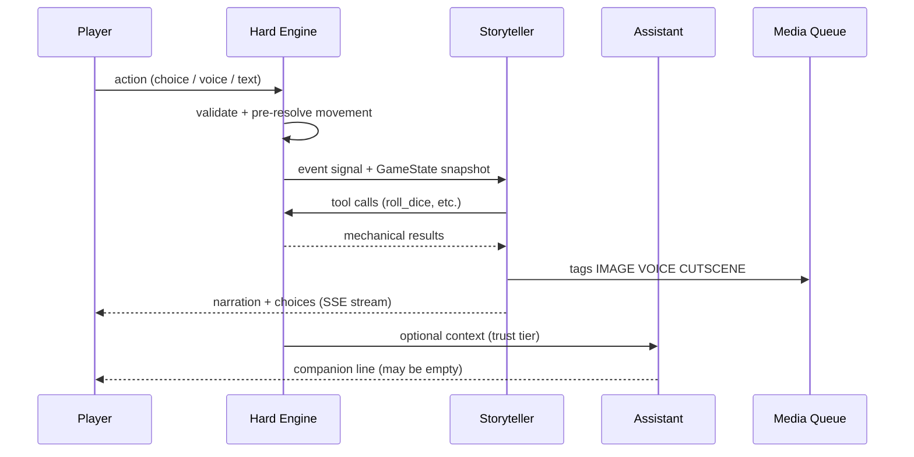
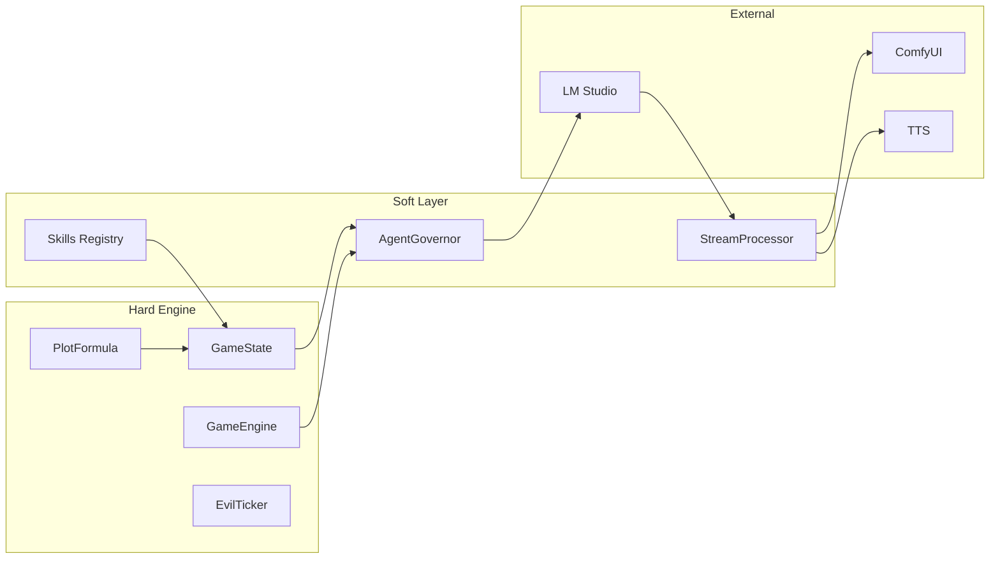

# The Clockwork Dark — System Design Document

**Version:** 0.2.0  
**Status:** PR1–PR12 implemented; overhaul phases P1–P11 applied  
**Last updated:** 2026-08-07

> **Reading this document.** Sections below describe systems that exist and run.
> Where something is designed but not wired, it is marked **NOT WIRED** with the
> file it lives in. That convention exists because this document previously
> described several mechanisms that were never called from any production path,
> and a design doc that describes a mechanism which does not run is how this
> codebase got into trouble. See [DESIGN_REVIEW.md](DESIGN_REVIEW.md) for the
> full record of what the overhaul found.

---

## Executive Summary

**The Clockwork Dark** is a local-first, AI-driven roleplaying game set on the frontier edge of a dying world. The player wakes in a forest beside **Edgewood**, the last comfortable village before the deep woods give way to the Marches and, further in, the Heartlands — where something called the **Clockwork Dark** is winding itself into the bones of civilization.

Unlike scripted RPGs, every scene is narrated in real time by autonomous local LLM agents. Unlike pure AI chat games, **mechanical truth lives in a deterministic engine**: dice land where the engine says they land, inventory changes only through validated tool calls, and the world's evil clock advances whether the player becomes a baker or a hero.

The game merges two proven architectures:

- **[Archives of Anubis](https://github.com/nihilistau/Achieves-Of-Anubis)** — hybrid hard engine + narrative council, RAG lore as source of truth, curse-phase escalation, speculative narrative decoding, ComfyUI/TTS integration.
- **[CosySim](https://github.com/nihilistau/CosySim)** — `AgentGovernor`, `@skill` decorator tools, SSE `StreamProcessor` tag injection, dual-agent scene pattern (`realm`), `WorldSim` background ticks, interceptor pipeline.

**Design pillars:**

| Pillar | Meaning |
|--------|---------|
| **Local-first** | LM Studio, ComfyUI/Grok, Voxtral TTS + ASR — no cloud dependency for core play, and every generative service off by default |
| **Engine is truth** | LLMs narrate; they do not adjudicate mechanics |
| **Agents have agency** | Storyteller and Assistant choose when to help, hinder, or stay silent |
| **Player freedom is real** | Quiet life is a valid complete experience; the main plot does not require the player |

---

## Glossary

| Term | Definition |
|------|------------|
| **EvilTicker** | Background system that advances `evil_progress` and `evil_phase` on world ticks |
| **Awareness** | Hidden player stat (0–100) gating rumor quality, cutscenes, and spoiler filters |
| **plot_involvement** | Engine-tracked measure of how entangled the player is in the main story (0–100) |
| **story_pressure** | Storyteller-internal meter; rises with plot_involvement; unlocks harder events |
| **Storyteller** | GM agent (`clockwork_storyteller`) — narrates world, runs NPCs, tunes difficulty |
| **Assistant** | Companion agent (`clockwork_assistant`) — speaks to player; may help or withhold |
| **Hard Engine** | Deterministic Python game logic — sole authority on stats, dice, inventory, travel |
| **Soft Layer** | LLM agents, interceptors, media queue — probabilistic presentation |
| **Skill** | `@skill`-decorated function the LLM must call for mechanical resolution |
| **Tag** | Inline stream token (`[IMAGE:…]`, `[STAT:…]`, etc.) parsed from LLM output |

**Evil phases (canonical):** `DORMANT` → `STIRRING` → `SPREADING` → `CONSUMING`

**Core location IDs:** `forest_clearing`, `edgewood_square`, `edgewood_bakery`, `tinker_caravan`, `millhaven_gate`

---

## World & Story Bible

### Setting: The Edgewood Margin

The known world is arranged in concentric rings of civilization and danger:

```
[Deep Forest] → [Edgewood Village] → [The Marches] → [Heartlands] → [The Wound]
     ↑                ↑                    ↑               ↑
  Player start    Quiet life arc      Whisper arc     Convergence arc
```

**Edgewood** is a scrappy frontier village: timber frames, a communal oven, a shrine to old saints nobody can name, and a road that traders use twice a season. Beyond the tree line, the forest is generous but not tame — mushrooms, game, herbs, and things that watch without moving.

**The Marches** are market towns, militia garrisons, toll roads. **The Heartlands** were once the seat of kingdoms. Now refugees speak of crops rotting in patterns, clocks running backward, and men who walk with tick-tick breath.

### Tone & Influences

| Source | What we take |
|--------|--------------|
| *The Name of the Wind* | Tinkers, oral lore, sympathy/naming as costly magic, mundane craft as dignity |
| *Dragonlance* | Mounting evil the world tries to ignore; reluctant involvement; companions with their own agendas |
| Archives of Anubis | Phase-based dread escalation; evaluator quality gate; echo of past runs |
| CosySim realm/tavern | Dual-agent banter; dice economy; living world ticks |

**Magic is grounded.** There are no fireball buttons. Magic costs Focus, material, and often a price in blood or memory. Naming something correctly matters more than shouting a spell name. The Clockwork Dark is not "a demon" — it is a **pattern** that converts living order into ticking, hungry mechanism.

### The Clockwork Dark (Antagonist)

The evil is a **metastasizing logic**: gears in wheat, brass filaments in nerves, militias that march in perfect time until they march into the sea. It does not announce itself in Edgewood. It **stains** the world inward.

The **EvilTicker** runs continuously:

| Phase | Progress | World signs (player may miss) | Agent behavior |
|-------|----------|-------------------------------|----------------|
| **DORMANT** | 0.0–0.2 | Odd dreams, one broken clock | Storyteller: pastoral; Assistant: absent or fleeting |
| **STIRRING** | 0.2–0.5 | Livestock stillborn with brass teeth; tinkers sell "ward charms" | Traders whisper; Assistant may appear as cat |
| **SPREADING** | 0.5–0.8 | Refugees, militia drafts, sympathy sickness | Forced world events rise; cutscenes unlock |
| **CONSUMING** | 0.8–1.0 | Heartlands lost; the pattern hunts names | Both agents intervene strongly |

`evil_progress` advances every world tick by a base rate modified by player inaction (slow) or proximity to Heartlands (fast). **The player is never required to stop it.**

### Story Arcs (Awareness-Gated)

Arcs and their gates live in `data/quests/arcs.yaml`; the gates are ordinary
quest predicates. Arcs are **monotonic** — they only ever open, never re-lock,
because the fiction cannot un-happen.

| Arc | Gate (as implemented) | Player experience |
|-----|-----------------------|-------------------|
| **Quiet Life** | default | Forest, bakery apprenticeship, festivals; Awareness stays <15 |
| **Whisper** | `caravan_arrival` seen **AND** 10 days since **AND** Awareness ≥15 | Maps sold, songs with wrong lyrics, child draws gears |
| **March** | visited `millhaven_gate` **OR** Awareness ≥25 | Militia, tolls, burned farmstead quests |
| **Convergence** | Awareness ≥50 **OR** evil_phase ≥ SPREADING | Name the wound, choose sacrifice, world-scale choices |

The caravan comes for everyone on a schedule that has nothing to do with the
player, so its arrival alone cannot be the Whisper gate — that would drag every
baker into the arc on a dice roll. What separates the two arcs is not that the
trader came, it is that the player **listened** to him.

24 quests, six per arc (`data/quests/<arc>/*.yaml`). Each arc is **valid**. The
game never punishes the baker for baking.

> **Caveat, measured.** Convergence's `min_phase: spreading` term is a timer, not
> a choice: it fires around in-game day 50 for every playstyle including the
> baker who never leaves the bakery. Arcs only open doors, so nothing is taken
> away — but "awareness-gated" is only half true. See DESIGN_REVIEW.md **R-06**.

### Key NPCs (Seed Roster)

| ID | Name | Role |
|----|------|------|
| `npc_maris` | Maris Hearth | Baker; quest hub for domestic arcs |
| `npc_odran` | Odran Cartwright | Caravan master; brings outward goods, inward rumors |
| `npc_ilya` | Ilya of the Nine Pins | Tinker; sells knowledge maps, sympathy charms |
| `npc_sera` | Sergeant Sera Venn | Millhaven militia; moral ambiguity |
| `npc_brindle` | Brindle | Cat that is sometimes the Assistant |

### The Assistant (Lore)

The Assistant is **not** a UI tutorial. It is an entity (or entities) that the Storyteller also cannot fully control. In Edgewood folklore they are the **Grey Wanderer**, the **Cat Who Knows**, the **Tinker’s Shadow**. They may:

- Offer a true hint disguised as nonsense
- Withhold help to test the player
- Appear in a form suited to trust level and plot_involvement
- Contradict the Storyteller (rare; high drama)

Agency parameters live in engine state and drift over sessions.

---

## The Two Agents

### Storyteller (`clockwork_storyteller`)

**Role:** Game Master, narrator, NPC chorus, difficulty tuner.

**Inherited from:**
- Anubis: Director + Proposer draft loop, Evaluator retry, RAG lore injection, curse-phase tone
- CosySim: `realm_director` JSON response contract, `AgentGovernor`, governance context

**Capabilities:**
- Describe scenes, voice NPCs, present 2–4 choices
- Request skill checks and combat via **required tools** (cannot fabricate outcomes)
- Adjust `story_pressure` — spawn harder encounters, grant mercy, trigger cutscenes
- Query full evil state via `query_evil_state` (player never sees raw numbers)

**Agency knobs** (stored in `GameState.storyteller_mind`):

```python
intervention_willingness: float  # 0-1: likelihood of forcing plot events
cruelty_bias: float              # 0-1: harsher consequences on failure
reward_generosity: float         # 0-1: loot, rep, mercy
patience: float                  # 0-100: low → more aggressive world events
```

**Output contract.** A **JSON Schema**, not a prose instruction — built per turn by
`engine/lmstudio/schemas.py::storyteller_turn_schema` and sent as
`response_format: {"type": "json_schema"}`.

```json
{
  "narration": "Second-person prose, 220–1400 chars…",
  "choices": [{"id": "a", "text": "…", "hint": "risky"}],
  "npc_voices": [{"npc_id": "npc_maris", "line": "…"}],
  "ledger_delta": {"facts": [], "names": {}, "npc_disposition": {}, "promises": []},
  "tool_calls": [{"name": "resolve_skill_check", "args": {"skill": "craft", "difficulty": "hard"}}]
}
```

`npc_id` is an **enum built per turn from the NPCs actually present**, so voicing
someone who is not in the room is unsampleable. `minItems: 2` on `choices` makes
the zero-choice soft-lock unreachable. `minLength`/`maxLength` state the length
rubric the evaluator was scoring against silently.

**Gone from the contract, deliberately:** `stat_changes`, `items_gained`,
`items_lost`, and `skill_check` with its `dc_mod`. The model used to be asked for
all four and the engine threw all four away, so the only thing they did was
create an incentive to try. Every mechanical effect now goes through a tool call
and `engine/game/effects.py::apply_effect`. The parser still tolerates the old
keys on input (`engine/agents/storyteller.py::parse_storyteller_response`) so a
model trained on the old prompt cannot crash a turn — but nothing reads them.

`structured_output: auto` (config) probes the server once and caches the answer;
small quantized models often ignore schemas entirely, so the brace-counting
JSON scanner stays in place as the fallback.

**Quality gate:** Lightweight Evaluator (Anubis pattern) scores tone, lore fit,
length, choice count, and — weighted heaviest — mechanical claims made without a
matching tool receipt. If score < 0.6, one retry with feedback. The retry rolls
back through `engine/game/transaction.py::StateTransaction` first: a draft the
player never saw must not keep its side effects.

### Assistant (`clockwork_assistant`)

**Role:** Player-facing companion; voice/text channel; optional STT listener.

**Reframed from** CosySim `realm_assistant` — **no fourth-wall**. The Assistant exists *in-world* as ambiguous folklore made real.

**Capabilities:**
- Short replies (1–3 sentences) via speech bubble UI
- `grant_hint`, `reveal_lore`, `change_form` as optional skills
- Push-to-talk STT → Assistant processes intent, may relay to Storyteller
- Emit `[VOICE:whisper]` / `[VOICE:urgent]` for TTS styling

**Agency knobs** (`GameState.assistant_mind`):

```python
trust_level: float           # 0-100: rises with player kindness, honesty
help_probability: float      # 0-1: roll each request for help
current_form: str            # cat | wanderer | child | tinker | reflection
appearance_schedule: str       # hidden | rare | common | desperate
```

**Information asymmetry:** Assistant never receives full `evil_progress`. It receives `hint_tier` derived from trust and plot_involvement — preserves mystery.

### Agent Interaction



Both agents share the **CosySim interceptor pipeline** but use different model profiles and skill manifests.

---

## Player Experience Loop

```
1. SESSION START
   └─ ProcGen seed → forest_clearing → character creation (archetype, name)

2. TURN LOOP
   ├─ Player selects choice / free text / voice
   ├─ Engine: validate action, apply movement/craft/trade preconditions
   ├─ Storyteller turn:
   │    ├─ PRE interceptors inject lore, evil tone, state
   │    ├─ LLM streams narration (speculative draft → refine)
   │    ├─ REQUIRED tools resolve checks/combat
   │    ├─ POST interceptors: TTS, ComfyUI queue, stat tags
   │    └─ Evaluator quality gate
   ├─ Assistant turn (probability roll, drawn from the seeded ASSISTANT stream):
   │    └─ May speak, change form, grant hint — or stay silent
   ├─ Quest evaluation (every turn, idempotent, engine-only predicates):
   │    └─ observe → unlock arcs → start eligible → advance/fail/complete
   ├─ Ledger: record the turn, meet whoever is present, decay facts,
   │    expire promises, summarize anything evicted from the buffer
   └─ Autosave + append transcript

   The world tick (EvilTicker + schedules) runs at the TOP of the turn, and
   only when world.tick_interval_seconds of real time has passed. Everything
   else moves the clock through engine/game/clock.py::advance_time as a cost
   of the action that spent the hours.

3. MILESTONE EVENTS
   └─ evil phase shift, Awareness threshold, location first-visit
       → CUTSCENE tag → ComfyUI video → letterbox UI + captioned TTS
```

---

## Game Mechanics (Hard Engine)

All mechanics live in `engine/game/`. Agents access them **only** through `@skill` tools with `TRIGGER_REQUIRED` where enforcement matters.

### Player Stats

| Stat | Range | Notes |
|------|-------|-------|
| **HP** | 0–max | Death threshold only — see Death, below. Wounds carry the weight |
| **Stamina** | 0–cap | Travel and labour spend it; **only rest restores it** |
| **Focus** | 0–max | Sympathy, naming, craft precision |
| **Reputation** | per-faction | Edgewood, merchants, militia |
| **Craft** | 0–100 | Baking, herbalism, tinker repair |
| **Awareness** | 0–100 | **Hidden** until ≥20 (then "something feels wrong") |
| **Grit / Agility / Wits / Presence** | 3–18 | Core attributes; skill checks derive modifiers from these |
| **Hunger** | 0–100 | 2/hour. `peckish` 40, `hungry` 60 (−20 stamina cap), `starving` 85 (−1 hp/hour, −2 to checks) |

Stamina has an **effective cap** below `max_stamina` while hungry. A player at
100/100 whose real ceiling is 80 has no way to read that off the raw numbers, so
`hunger_stage` and `stamina_cap` are both in the client payload.

### Survival & Rest (`engine/game/survival.py`)

Awake stamina regeneration is **zero, on purpose**, and the knob is in
`data/rules/survival.yaml` so the decision is visible in data rather than implied
by an absent line of code. Rest is the only thing in the game that raises
stamina, and it costs hours — which is what the evil clock eats. Stopping to
sleep is the most expensive safe thing you can do, and it has to stay that way.

Rest never refuses. A bed you cannot reach downgrades to sleeping rough (a
survival check, worse outcome on a failure). **Any location gate on rest
rebuilds the soft-lock**; see DESIGN_REVIEW.md issue R-04.

### Dice & Skill Checks (`engine/game/checks.py`)

- Standard: `d20 + itemised modifiers vs DC`
- **The model never supplies a DC.** It names a difficulty *band*; the engine
  derives the number from `data/rules/skills.yaml`:
  `trivial 8 · easy 10 · standard 13 · hard 16 · severe 19 · legendary 22`
- Skill taxonomy (seven): `persuasion`, `stealth`, `sympathy`, `lore`, `craft`,
  `survival`, `nerve`
- Modifiers are **itemised** in `CheckResult.modifiers` and the deltas sum to the
  number applied to the die: stat modifier, archetype affinity, situational rows
  (darkness, exhaustion, starvation, evil phase), open wounds, timed effects.
  The receipt shows the whole arithmetic, which is what makes an engine-resolved
  failure feel fair rather than arbitrary.
- Four degrees by margin: `crit_success` (+10), `success` (0), `partial` (−4),
  `failure`. **Partial is not success.**
- Natural 20 draws a boon, natural 1 a complication, both from
  `data/tables/*.yaml` — never LLM invention. Advantage reads the *kept* die, so
  it genuinely buys a second chance at the boon.

### Conflict as a scene, not a combat system (`engine/game/encounter.py`)

There is no initiative order, no armour class and no per-round turn loop —
those would contradict the "no fireballs, no MMO combat spam" pillar and turn
every roadside argument into a five-minute minigame. A conflict is a **scene**:
one to three contested checks against a threat's `resolve`. The player picks an
*approach* (talk, fight, sneak, pay, walk away) and the engine resolves it
through `checks.py` like everything else. `flee` is merged into every encounter
by `data/encounters/rules.yaml`, because a scene with no legal exit is a
soft-lock.

Approach availability is **engine-authored**: anything the player cannot pay for,
cannot reach at this hour, or lacks the item for is simply absent from the list,
so the narrator is never in a position to offer a choice the engine will refuse.

Consequences are **wounds**, not hit points: *"a knife-line across your forearm,
−2 to craft until day 9"* survives into the next scene and reads back into
narration for free.

### Death (`data/rules/death.yaml`)

Death is a **setback**, not a game over. You wake in Edgewood Square ten hours
later at 35% hp, half your purse gone, carrying a −2 wound that takes five days
to close — and the evil kept its own hours the whole time you were down.
`state.ended` is set in exactly one case: a *second* death while the world is
already `consuming`, when there is no longer anyone left to come out and fetch
you.

### Crafting & Professions

Recipes exist in `data/recipes/*.yaml` and items in `data/items/*.yaml`. Buying
and selling run through the `trade` skill against `data/economy.yaml`.
`craft_item(recipe_id)` is a real skill
(`engine/skills/builtin/mechanics.py`, `tests/test_craft.py`): refusals —
unknown recipe, wrong station, missing tool, short of inputs — come **before**
anything is spent; the hours and inputs are then consumed on the attempt, pass
or fail; the outcome is resolved by `checks.resolve` on the recipe's declared
band with degrees (a crit adds one to the batch, a partial wastes some, a
failure falls back to the recipe's declared salvage). `list_recipes` tells the
narrator what could be attempted here and what it needs.

### Inventory schema (v0.1)

```python
{id: str, name: str, qty: int, tags: list[str]}
```

Stored as `InventoryItem` in `GameState.inventory`.

### Economy & Trade

- Each location has supply/demand tables
- `trade(action, item_id, npc_id)` — prices from engine, not narration
- Caravan events inject rare goods and rumor packets

### Travel

Location graph (not grid). Each edge has `travel_time_hours`, `danger_dc`, `awareness_delta`.

```
forest_clearing ──1h── edgewood_square ──4h── millhaven_gate
         │                    ├── edgewood_bakery (0h)
         │                    └── tinker_caravan (0h, event-gated)
```

Each edge carries `hours`, `danger_dc`, `awareness_delta`. Locations carry `evil_multiplier` (forest 0.5, bakery 0.7, Edgewood 0.8, caravan 0.9, Millhaven 1.2).

`move_to(location_id)` validates stamina, spends it, advances the clock through
`clock.advance_time`, applies `awareness_delta`, and rolls the encounter table
off the edge's `danger_dc`. Measured encounter rate on the one dangerous edge
in the graph (`edgewood_square ↔ millhaven_gate`, `danger_dc: 12`): **0.42–0.89
per leg** depending on hour and evil phase (`scripts/simulate.py`). Every other
edge is `danger_dc: 0` and can never produce one.

An unresolved scene is not overwritten by walking away from it. Travel always
completes; the road does not get to hand you a second problem while the first
is open.

### Awareness System

Awareness rises from:

| Source | Delta |
|--------|-------|
| Hear rumor (verified) | +3 to +8 |
| Witness anomaly event | +5 |
| Travel inward | +2 per ring |
| Assistant hint (true) | +2 |
| Ignore 3 consecutive anomaly hooks | -1 (denial) |

Gates:

- **Rumor quality:** low Awareness → vague unease; high → names, places, dates
- **Cutscenes:** `[CUTSCENE:…]` only if Awareness ≥ threshold
- **Assistant forms:** `reflection` form locked until Awareness ≥40

### The World Clock (`engine/game/clock.py`)

**One writer.** `advance_time(state, hours)` is the only function permitted to
move world time. `world_day`, `world_hour` and `time_of_day` are **derived
read-only properties** of a single float, `world_clock_hours`.

This is the most consequential correction in the project's history. Time used to
live in two independent ints advanced by `state.world_day += int(days_elapsed)`,
and the only production caller passed `0.25`. `int(0.25) == 0`, so the calendar
never moved and the evil ticker was multiplied by an elapsed time of zero for
the entire life of the codebase. Every system downstream of the clock — evil
progression, hunger, timed-effect expiry, wound healing, NPC schedules, quest
deadlines — was dead in the same way, and **no balance constant in this document
had ever been observed against a clock that runs.**

Everything that consumes elapsed time hangs off `advance_time`, so it cannot be
bypassed by a caller who forgets a step. Death handling re-enters the clock
(unconsciousness costs hours), which is why there is a thread-local re-entrancy
guard: unguarded, each nested call ran the death check again and the calendar
ran away — measured jumping day 2 to day 123 in a single 8-hour step.

### EvilTicker

```python
# Units: evil_progress is dimensionless 0.0–1.0
# evil_base_rate_per_day from config

evil_progress += evil_base_rate_per_day * days_elapsed * location.evil_multiplier * inaction_bonus
evil_phase = phase_from_progress(evil_progress)  # [0,0.2) DORMANT, [0.2,0.5) STIRRING, ...

plot_involvement = PlotFormula.compute(state)      # engine/game/plot.py
story_pressure = PlotFormula.update_story_pressure(state)  # on GameState
```

`inaction_bonus` is `1 + (1 − plot_involvement/100) * 0.35` — the world moves
faster around a player who is not pushing back. (It previously compared
`world_day` to `turn_number`, which once the clock was fixed would have grown
without bound simply because days pass faster than turns.)

`GameState` fields: `evil_progress`, `evil_phase`, `plot_involvement`, `story_pressure`, `awareness`, `procgen: ProcgenResult`.

Storyteller receives full snapshot via `query_evil_state`; player UI shows only diegetic signs.

**Measured pacing** — `scripts/simulate.py`, 200 turns per policy, seed 42, base
rate 0.006. The clock runs at **3.2–6.5 in-game hours per turn** depending on
how the player lives. The largest term is the background world tick
(`world.tick_hours`, 2.0), which is now proportional to the *real* time the
player spends on a turn, capped at `world.tick_max_hours`.

| Policy | h/turn | Effective rate/day | CONSUMING at in-game day | ≈ turns | Deaths |
|--------|--------|-------------------|--------------------------|---------|--------|
| baker — never leaves Edgewood | 4.16 | 0.00564 | 142 | ~811 | 0 |
| cautious — village circuit, road by daylight | 3.21 | 0.00534 | 150 | ~1109 | 4 |
| pauper — no gold ever spent | 3.77 | 0.00459 | 174 | ~1125 | 1 |
| reckless — Millhaven constantly | 6.46 | 0.00635 | 126 | ~467 | 30 |

Read three things out of that table. First, the mechanism works and the numbers
are real. Second, the playstyles now genuinely diverge: the baker ends the run
`quiet_life` and DORMANT at awareness 0, the reckless player ends `convergence`
and STIRRING at awareness 100, and the reckless player reaches CONSUMING in
about **40% of the turns** the cautious one needs. That spread used to be under
10% — see [DESIGN_REVIEW.md](DESIGN_REVIEW.md) issues **R-03** (the clock, fixed)
and **R-06** (the convergence it was masking).

Third, **it is possible to survive without money**: the `pauper` policy spends
zero gold across 200 turns, eats entirely from foraging, and ends richer than it
started.

Earlier revisions of this section blamed the 8-hour sleep for the pace. That was
measured and found wrong — sleep is 0.7–1.4 h/turn amortised, and was never
within a factor of four of the tick.

Reproduce with:

```powershell
.\.venv\Scripts\python.exe scripts\simulate.py --turns 200 --seed 42 --policy all
```

---

## Procgen World

### Edgewood Village (seeded)

- 12 buildings, 8 NPCs (5 canon + 3 procedural), 1 festival per season
- **Bakery job day varies with the world seed** — `ProcgenResult.bakery_job_day`,
  read by the `procgen_day` quest predicate. It was generated on every run since
  PR7 and read by nothing at all until P7
- Shrine with incomplete mural (lore hook)
- NPCs run **hourly routines** with activity strings
  (`engine/world/npc_sim.py`, `data/world/npc_schedules.yaml`), so who is in the
  room depends on the hour rather than on a static location field

### Forest (seeded)

- 6 forage nodes, 2 hidden paths, 1 optional barrow dungeon
- Forage nodes are reachable through the `forage` skill
  (`engine/game/foraging.py`), which is what closed **R-05** — a repeatable,
  gold-free food source; the `pauper` simulator policy survives 200 turns
  spending zero gold
- Hidden paths are **discoverable while foraging** and act as travel
  shortcuts: `GameEngine.move_to` prices a discovered path's two ends at
  `SHORTCUT_HOURS` (`engine/game/foraging.py::shortcut_hours`,
  `tests/test_hidden_paths.py`)
- Encounter tables are banded by evil phase (`data/encounters/*.yaml`)

### Trader & Tinker Schedule

From `data/world/schedules.yaml`. Each event draws from its **own named RNG
stream**, so they are independent of each other and replay from the save seed.

| Event | Probability | Effect |
|-------|-------------|--------|
| `caravan_arrival` | 8% per in-game day, from day 5, lasts 2 days | Odran at Edgewood Square + goods + rumor packet |
| `tinker_camp` | 5% per week, lasts 3 days | Ilya at the caravan + knowledge trade |
| `militia_press` | 3% per day, **only if Awareness ≥20**, lasts 1 day | Sergeant Sera visits the square |

World events expire from `state.world_events` after their duration, so the quest
engine writes down the **day they were first seen** (`quests["_meta"]`) — the
Whisper gate needs "the caravan came on day six" ten days later, by which time
the event itself is long gone from state.

Templates in `data/procgen_templates/`.

---

## Media & Presentation

### Visual

Images resolve through a **four-tier provider chain**
(`engine/media/providers/`), in this order:

1. **Shipped art pack** — `data/art/manifest.yaml`. Instant, and what a shipped
   example game should do.
2. **Disk cache** — keyed by `(subject_id, kind, time_of_day, evil_phase)`.
3. **Live generation** — `media.live_generation`, **off by default**. Grok
   Imagine or ComfyUI. Off because a Grok still takes 2–3 minutes, which cannot
   sit inside a real-time turn; ComfyUI is seconds and is the backend worth
   turning it on for. Use `scripts/generate_art.py` to fill gaps ahead of time
   rather than paying for them mid-turn.
4. **Deterministic procedural SVG** — the floor. A missing picture never blocks
   play and never shows an empty frame.

| Asset type | Trigger |
|------------|---------|
| Location still | scene change / `[IMAGE:location_id_mood]` |
| NPC portrait | first meeting |
| Enemy art | encounter `art:` key |
| Cutscene video | `[CUTSCENE:milestone_id]` |

`CutsceneBudgetInterceptor` enforces the phase-shift-only video budget.

### Audio

| Channel | Engine | Default |
|---------|--------|---------|
| Storyteller narration | Voxtral TTS (`:8123`) | **off** — measured ~21× slower than realtime |
| NPC lines | per-NPC voice profile | off with narration |
| Assistant | form-dependent voice, `tts.assistant_enabled` | **off**, but the only channel worth speaking live: 1–3 sentences |
| Player input | Voxtral ASR — a **CLI**, not a server; the adapter shells out | available |

Narration is split on sentence boundaries (`tts.max_chars: 400` is a hard server
limit, not a preference — longer input returns HTTP 400) and queued on a
background worker. **Audio crosses the socket as a URL to a file on disk, never
as bytes**; raw bytes in a turn payload take the whole turn down at `jsonify`.

### UI Layout

```
┌─────────────────────────────────────────────────────────────┐
│  [Location visual — ComfyUI still or cutscene letterbox]    │
├──────────────┬──────────────────────────────┬───────────────┤
│  Assistant   │  Narrative log (SSE stream)    │  Stats sheet  │
│  bubble      │  Choice chips / text input     │  Inventory    │
│              │  Dice toast overlay            │  Reputation   │
├──────────────┴──────────────────────────────┴───────────────┤
│  [Mic]  [Send]  World day · Time · Weather (diegetic)       │
└─────────────────────────────────────────────────────────────┘
```

---

## Technical Architecture

### Stack

| Layer | Choice | Rationale |
|-------|--------|-----------|
| Runtime | Python 3.13 | Matches both parent repos |
| Scene server | Flask + Socket.IO (`FlaskScene` pattern) | CosySim skills/MCP/interceptors |
| Client | Vite + React 18 in `ui/`, built into a committed `static/dist` | Real state management for a stateful game; committed build means no Node needed to play |
| Inference | LM Studio `:1234`, SSE + `json_schema` structured output | Local-first |
| Speculative | `draft` model 0.5B–1B → `big` 8B refine | Anubis + CosySim profiles |
| Lore | SQLite FTS; Nexus KMS optional | Progressive enhancement |
| Media | Shipped pack → cache → Grok/ComfyUI (off) → procedural SVG | Instant by default, generative by choice |
| Persistence | Atomic JSON saves, backup recovery, forward migration chain | Simple, inspectable, and survivable |

### Memory & Context (`engine/memory/`)

Narrative memory is engine-owned, not a chat transcript.

- **StoryLedger** — facts with decay and a salience ranking, pinned names, NPC
  relations and dispositions, promises with expiry, open threads kept in sync
  with the active quest list, plus a rolling verbatim turn buffer.
- **Rolling summary** — a record evicted from the turn buffer is folded into a
  running summary by a dedicated call on the `small` profile. Explicitly *not*
  the Storyteller's own callable: that one is prompted to produce game turns and
  answers a summarization request with narration JSON, which then became the
  summary verbatim. Falls back to deterministic compression when LM Studio is
  unreachable.
- **Token budget** — `Budget.available` is `context_tokens − reserve_output`
  less a 15% safety margin. Blocks are evicted in a fixed order
  (`turns → lore → threads → summary`); persona and world state are never
  evictable. No tiktoken: it is the wrong tokenizer for a llama or qwen GGUF.
  The budget is **asserted in tests, not defended at runtime**.
- **Stable-first block order** — persona, standing rules and few-shot examples
  are byte-identical every turn and come first, so the KV prefix cache survives
  between turns. The old prompt put HP and the current hour in the middle of the
  standing rules, so nothing cached and every turn reprocessed the whole prompt.

> **Fixed defect (R-01):** `StorytellerAgent._build_messages` used to run the
> PRE interceptors over the system blocks *after* `build_storyteller_messages`
> had fitted them, so `LoreInjectInterceptor` appended uncounted lore per
> system block — ~7.5k tokens sent against a 6,198 budget on a seeded lore DB.
> Lore retrieval now lives in `engine/memory/context.py`, inside the budget;
> only the awareness gate runs after fitting. The former `xfail` in
> `tests/test_vertical_slice.py` is now a regression guard
> (`test_the_prompt_that_is_sent_also_fits_the_budget`). See DESIGN_REVIEW.md
> **R-01** for the history.

### Directory Layout

See [CLAUDE_CODE_BRIEF.md](CLAUDE_CODE_BRIEF.md) for full scaffold.

### Data Flow



### Anti-Hallucination Rules

What actually runs, in the order a turn hits it:

1. **The model cannot express a mechanical change.** `stat_changes`,
   `items_gained`, `items_lost` and `skill_check` are not in the output schema.
   The only way to move a number is a tool call, and every tool call funnels
   through `engine/game/effects.py::apply_effect`.
2. **Skills are partitioned by an agent allowlist**
   (`engine/skills/registry.py::SkillDef.agents`, enforced in
   `engine/agents/tool_dispatcher.py`). Trigger/category metadata used to be
   decorative — the dispatcher executed anything present in the registry, so the
   unbounded system-only world tick was fully reachable from narration.
3. **The engine picks the DC.** The model names a difficulty band and nothing
   else; see Dice & Skill Checks.
4. **The engine decides quest progress.** Every `complete_when` predicate is
   engine-evaluable. The model's single lever is `set_narrative_flag`, and only
   for flags the *current* stage of an *active* quest has declared.
5. **Evaluator rejects mechanical prose without a tool receipt** — narration
   claiming "you rolled 18" scores 0.2 on the heaviest-weighted criterion and
   fails the gate. One retry, with the rejected draft's side effects rolled back.
6. **RAG lore** is canonical for world facts and is scored against the *same*
   chunks the model was shown.
7. **AwarenessGate interceptor** strips spoiler phrasing below the threshold.

> **`SceneRulesEngine` is wired** — via `RulesGovernor`
> (`engine/agents/governance.py`), which runs R001–R005 over every resolved
> turn: `StorytellerAgent.run_turn` calls `get_governance().run_post(...)`
> after `tx.commit()`, so the audit judges the state the player actually ends
> the turn in, and violations ride out on `StorytellerTurnResult.governance`.
> It spent five PRs as dead code with a passing test suite — see
> DESIGN_REVIEW.md **R-02** for that history. Items 1–4 above remain the
> primary guarantee, by construction; the governor is the second layer of
> defence, and R003 additionally counts a model's unearned stat claims through
> `Oracle.record_unearned_claim` because a model claiming fifty gold on one
> turn in three is a prompt defect you can only see by counting it.

### Inference Pipeline

```
1. Speculative pass (draft model, ~50ms skeleton)
2. Stream refine (big model, SSE to UI)
3. StreamProcessor extracts tags during stream
4. REQUIRED skills dispatched before JSON epilogue merge
5. Evaluator scores final packaged turn
```

---

## Key Decisions

| # | Decision | Rationale |
|---|----------|-----------|
| 1 | **New repo** `clockwork-dark/` | Avoid CosySim cyberpunk coupling and Anubis dungeon grid assumptions |
| 2 | **Engine-authoritative mechanics** | Prevents LLM cheating; enables fair replay |
| 3 | **Dual agents** (not 5-agent council) | Intimacy + lower latency on 12GB VRAM; Evaluator retained |
| 4 | **CosySim `@skill` over raw AgentScope** | Decorator ergonomics, cooldowns, MCP alignment, proven interceptors |
| 5 | **FlaskScene over FastAPI-only** | Matches CosySim scene catalog; faster port of realm/tavern patterns |
| 6 | **Awareness as hidden stat** | Preserves "clock unknown" fantasy for quiet-life players |
| 7 | **Optional Nexus KMS** | Local vector store sufficient for v0.1; Nexus as upgrade |
| 8 | **Echo system deferred** | Anubis-style past-run ghosts. Still deferred; permadeath is now settled (see Open Questions) |
| 9 | **Video cutscenes milestone-only** | GPU budget control — max 1 video per 30 min session default |
| 10 | **Assistant in-world** | Raistlin/Gandalf tone requires removing fourth-wall meta humor |
| 11 | ~~**JSON save v1, no migration**~~ → **JSON saves with a forward migration chain** | **REVERSED.** See below. |
| 12 | **Speculative decode optional** | Falls back to single-model stream if draft model unavailable |
| 13 | **JSON parse failure** | Retry once with repair prompt; then template fallback choices. The scanner counts braces rather than matching a regex — the old `[^{}]*` fallback forbade nested braces, so it could never match the mandated payload and the player was shown raw JSON as narration |
| 14 | **Turn state is transactional** | A draft rejected by the Evaluator is rolled back before the retry. It used to keep its side effects: the player was moved and drained by a narration they never saw |
| 15 | **One mutation dispatcher** | Every state change — quest reward, boon, complication, encounter outcome, death — goes through `effects.apply_effect`, so it is validated, clamped and receipted identically wherever it came from |
| 16 | **Named, replayable RNG streams** | `world_rng(state, stream)`. Adding an encounter roll must not shift the caravan schedule. The world sim previously rebuilt `random.Random(seed + world_day * 9973)` every tick — and since the day never advanced, all three schedule rolls consumed the same frozen draw forever |

#### Decision 11, reversed: saves migrate

"JSON save v1, no migration" was already untrue by the time saves existed. The
overhaul changed the state schema several times over — derived world clock,
named RNG streams, survival fields, attributes, encounter and quest blocks —
and retrofitting a migration chain after three breaking changes costs far more
than carrying one from the start.

`CURRENT_SAVE_VERSION` is **2**. `engine/persistence/`:

- **Atomic writes** — temp file plus `os.replace`, so a crash mid-save cannot
  leave a truncated JSON where a run used to be.
- **Backup recovery** — the previous save is retained and loaded when the
  current one will not parse.
- **Forward migration chain** — `engine/persistence/migrations.py`. Each step is
  `v → v+1`, must be total, runs **in memory on load** (nothing is rewritten on
  disk until the next ordinary save, so a failed load never destroys the
  original), and is **never deleted**. `_v1_to_v2` folds the old
  `world_day`/`world_hour` int pair into `world_clock_hours`, seeds `rng_seed`
  from the procgen seed, and backfills the survival and attribute fields.
- **Unknown keys are ignored on load** (`GameState.from_dict`) rather than
  raising, so a save written by an older build still opens after new fields land.
  The old code splatted raw dicts into constructors, and a single added field
  made every existing save unloadable with a bare `TypeError`.
- **Autosave every turn**, plus an append-only transcript beside the save.
- **Resume on reconnect** — `SessionStore.resume(save_id)`. The client used to
  call `/api/game/new` on every reconnect, silently discarding the run.

Two serializers, never merged: `to_save_dict()` is complete and lossless and is
the only thing persistence writes; `to_client_dict()` is a redacted allowlist and
is the only thing the browser sees. The previous single
`to_dict(include_hidden=)` dropped both `AgentMind`s, so any round trip reset
evil progress, awareness and trust to defaults.

### Implementation decisions

| Topic | Decision |
|-------|----------|
| Save format | JSON in `data/saves/`, `save_version: 2`, atomic + migrated |
| FlaskScene | Ported in PR10 |
| Skill enforcement | Agent allowlist in the dispatcher + engine-owned DCs + Evaluator receipt check, plus `SceneRulesEngine` R001–R005 run post-turn by `RulesGovernor` (`engine/agents/governance.py`) |
| Lore | `LoreInject` is a no-op when the DB is empty; seed with `scripts/seed_lore.py` |
| Frontend | Vite + React in `ui/`, built into a **committed** `content/scenes/clockwork/static/dist` so the game runs without Node |

---

## Skills & Tags Manifest

**35 registered skills**, partitioned by an **agent allowlist**
(`SkillDef.agents`). The allowlist — not the trigger, not the category — is what
the dispatcher enforces. A skill a given agent is not on cannot be called by it,
and the refusal comes back as a legible receipt so the model can correct itself.

Implementations: `engine/skills/builtin/mechanics.py` (14),
`engine/skills/builtin/livelihood.py` (10), `engine/skills/builtin/items.py`
(6), `engine/skills/builtin/assistant.py` (3),
`engine/skills/builtin/quests.py` (2). Verify with:

```powershell
.\.venv\Scripts\python.exe -c "import engine.skills.builtin, engine.skills.builtin.quests; from engine.skills.registry import SKILL_REGISTRY as R; tools = sorted(R.all_tools(), key=lambda s: (s.category, s.name)); print(len(tools)); [print(f'{s.name:20} {s.category:10} {s.trigger:9} {s.agents}') for s in tools]"
```

| Skill | Category | Trigger | Callable by |
|-------|----------|---------|-------------|
| `collections` | GAME | optional | storyteller |
| `craft_item` | GAME | optional | storyteller |
| `eat` | GAME | optional | storyteller |
| `encounter_approach` | GAME | required | storyteller |
| `equip_item` | GAME | optional | storyteller |
| `flee` | GAME | optional | storyteller |
| `forage` | GAME | optional | storyteller |
| `list_recipes` | GAME | optional | storyteller |
| `move_to` | GAME | required | storyteller |
| `query_equipment` | GAME | optional | storyteller |
| `query_forage` | GAME | optional | storyteller |
| `query_inventory` | GAME | optional | storyteller |
| `query_work` | GAME | optional | storyteller |
| `resolve_skill_check` | GAME | required | storyteller |
| `rest` | GAME | optional | storyteller |
| `roll_dice` | GAME | required | storyteller |
| `sleep_until` | GAME | optional | storyteller |
| `trade` | GAME | optional | storyteller |
| `trade_browse` | GAME | optional | storyteller |
| `trade_buy` | GAME | optional | storyteller |
| `trade_haggle` | GAME | optional | storyteller |
| `trade_quote` | GAME | optional | storyteller |
| `trade_sell` | GAME | optional | storyteller |
| `unequip_item` | GAME | optional | storyteller |
| `use_item` | GAME | optional | storyteller |
| `work` | GAME | optional | storyteller |
| `change_form` | NARRATIVE | optional | **assistant** |
| `grant_hint` | NARRATIVE | optional | **assistant** |
| `inspect_item` | NARRATIVE | optional | storyteller |
| `query_encounter` | NARRATIVE | required | storyteller |
| `query_evil_state` | NARRATIVE | required | storyteller |
| `query_quests` | NARRATIVE | optional | storyteller |
| `reveal_lore` | NARRATIVE | optional | **assistant** |
| `set_narrative_flag` | NARRATIVE | optional | storyteller |
| `advance_world_tick` | SYSTEM | system | **system only** |

`advance_world_tick` is deliberately unreachable from either agent. Exposed to
the model, an unbounded `days` argument is a time machine: negative values
rewound the calendar and large ones jumped the world straight to CONSUMING in a
single call. Time advances through play — travel, rest, work — or not at all.

| Tag | Effect | PR |
|-----|--------|-----|
| `[IMAGE:prompt]` | ComfyUI still | 9 |
| `[CUTSCENE:id]` | Video cutscene | 9 |
| `[VOICE:style]` | TTS style | 9 |
| `[STAT:name±val]` | Stat delta (requires tool receipt) | 5 |
| `[ACTION:x]` | Game event | 5 |
| `[MOOD:x]` | Tone metadata | 5 |

---

## PR Plan — complete

The original twelve-PR build plan, with t-shirt sizes. **All twelve shipped.**
It is kept as a record of how the game was assembled; what the code does *now*
is described in the sections above and in
[The Overhaul (P1–P11)](#the-overhaul-p1p11) below, which corrected a great deal
of it.

### PR1 — Repository Scaffold ✅ (S)
- **Files:** `pyproject.toml`, `requirements.txt`, `pytest.ini`, `config/default.yaml`, `engine/config.py`, `launcher.py`, `scripts/start.ps1`, `tests/conftest.py`
- **Dependencies:** none
- **Done when:** `pytest` runs; `python launcher.py --help` works

### PR2 — GameState + EvilTicker ✅ (M)
- **Files:** `engine/game/state.py`, `evil_ticker.py`, `locations.py`, `dice.py`, `plot.py`, `engine.py`, tests
- **Dependencies:** PR1
- **Done when:** serialize round-trip; evil monotonic; phase boundaries tested

### PR3 — Skills + Rules Engine ✅ (M)
- **Files:** `engine/skills/registry.py`, `builtin/mechanics.py`, `engine/mcp/scene_rules_engine.py`, `data/economy.yaml`, `content/scenes/clockwork/clockwork_skills.py`, `test_skill_enforcement.py`
- **Dependencies:** PR2
- **Done when:** SceneRulesEngine R001–R005 tests pass; **not** Evaluator (that's PR5)

### PR4 — LMSClient + StreamProcessor ✅ (L)
- **Files:** `engine/lmstudio/client.py`, `events.py`, `profiles.py`, `speculative.py`, `engine/agents/stream_processor.py`
- **Dependencies:** PR1
- **Done when:** Mock SSE tests pass; `infer_processed()` extracts `[IMAGE:]`, `[CUTSCENE:]`, `[STAT:]`; speculative draft→refine fallback

### PR5 — Storyteller Agent ✅ (L)
- **Files:** `engine/agents/storyteller.py`, `evaluator.py`, `tool_dispatcher.py`, `prompts.py`
- **Dependencies:** PR3, PR4, **PR11 stub OK**
- **Done when:** JSON parse, tool_calls execution, Evaluator retry on hallucinated mechanics, mock LLM tests pass

### PR6 — Assistant Agent ✅ (M)
- **Files:** `engine/agents/assistant.py`, `engine/skills/builtin/assistant.py`, `engine/media/stt.py`
- **Dependencies:** PR4 minimum; full integration PR5
- **Done when:** Agency silent/help branches, form system, grant_hint/reveal_lore/change_form skills, STT stub, mock LLM tests pass

### PR7 — ProcGen Edgewood ✅ (M)
- **Files:** `engine/game/procgen.py`, `data/procgen_templates/edgewood.yaml`, extended `ProcgenResult`
- **Dependencies:** PR2
- **Done when:** Same seed yields identical NPCs/buildings/forest; 8 NPCs (5 canon + 3 procedural), 12 buildings, `new_game_state()` helper, tests pass

### PR8 — WorldSim + Traders ✅ (M)
- **Files:** `engine/world/world_sim.py`, `engine/world/schedules.py`, `data/world/schedules.yaml`
- **Dependencies:** PR2, PR7
- **Done when:** `WorldSim.on_tick` advances evil + schedules; forced `caravan_arrival` stores rumor/event; militia gated by awareness; tests pass

### PR9 — Media Pipeline ✅ (L)
- **Files:** `engine/media/comfyui.py`, `tts.py`, `cutscene.py`, `pipeline.py`, `interceptors.py`, `data/procgen_templates/comfyui.yaml`
- **Dependencies:** PR4
- **Done when:** ComfyUI queue receives image jobs (mock/placeholder), TTS text fallback, cutscene phase-shift budget, Storyteller turn emits `media` dict, tests pass

### PR10 — Frontend Scene ✅ (L)
- **Files:** `content/scenes/clockwork/*`, `engine/scenes/flask_scene.py`, `launcher.py`
- **Dependencies:** PR5, PR6, PR7, PR8, PR9
- **Done when:** Browser loads `:5573`; REST + Socket.IO `player_choice` emits `turn_update`; health/new/choice/state routes work; tests pass

### PR11 — RAG Lore Seed ✅ (M)
- **Files:** `engine/lore/manager.py`, `engine/lore/interceptors.py`, `scripts/seed_lore.py`, `data/lore/*.md`
- **Dependencies:** PR1
- **Done when:** `seed_lore.py` ingests markdown; FTS retrieval returns chunks; LoreInject + AwarenessGate wired to Storyteller; tests pass

### PR12 — Vertical Slice Playtest ✅ (S)
- **Files:** `tests/test_vertical_slice.py`, `scripts/simulate.py`
- **Dependencies:** PR1–PR11
- **Done when:** two ~40-turn scripted playthroughs (baker, Millhaven) against a
  deterministic mock LLM assert the clock advanced, evil rose with it, a
  mid-run save resumed identically, the prompt fit the budget, the ledger
  accumulated and the model saw prior turns, a quest completed, the baker never
  unlocked the Whisper arc, every payload was JSON-serializable, and stamina
  never pinned at zero.

---

## The Overhaul (P1–P11)

The PR plan above describes how the game was *built*. It is complete. What
followed was a correction pass, numbered P1–P11, which is where most of the
architecture in this document actually came from. The suite went from 97 tests
to 600+ during the overhaul; it stands at ~1,400 now.

| Phase | What it did |
|-------|-------------|
| **P1** | State serializer split; `clock.py` and derived time; atomic saves + migrations; ContextVar session isolation; thread-safe lore; RNG isolation; skill agent allowlist; system-only time skills; session lock + autosave; TTS bytes → disk |
| **P2** | Narration streaming; `engine/memory/` (ledger, rolling summary, token budget, stable-first block order); LM Studio transaction/gate/JSON schema/tool calls; turn loop; stack config with `config/local.yaml` deep-merge; Voxtral TTS |
| **P3** | Vite + React UI: design tokens, socket store, components and screens; Jinja serves the built app; UI contract tests |
| **P4 / P5** | Survival (hunger, rest, the stamina soft-lock fix); the 7-skill taxonomy, difficulty bands, itemised modifiers, degrees; `effects.py` single mutation dispatcher; archetypes → starting kit; `skill_check`/`dc_mod` contract removed |
| **P6** | Encounters as contested scenes; edge `danger_dc` finally read; wounds; death rules |
| **P7** | Quest engine — 24 quests across 4 awareness-gated arcs, engine-only stage predicates, `set_narrative_flag` as the model's one lever |
| **P8** | Media providers: shipped art pack → cache → live generation (off by default) → deterministic procedural SVG |
| **P9** | Content pass: items registry, economy, recipes, art manifest, content-integrity tests |
| **P10** | Cutscene and settings UI; `engine/stack.py`, `launcher.py --stack/--check` |
| **P11** | Hardening: `scripts/doctor.py`, `tests/test_vertical_slice.py`, `scripts/simulate.py`, and this documentation correction |

---

## Open Questions

| Question | Status |
|----------|--------|
| Permadeath? | **Settled.** Respawn in Edgewood Square: 10 hours lost, 35% hp, half the purse, a −2 wound for 5 days. `state.ended` only on a second death during `consuming`. See `data/rules/death.yaml` |
| Video cutscene budget | **Settled.** Phase shifts only (`media.cutscene_budget: phase_shift_only`) |
| Live image generation | **Settled: off by default.** A Grok Imagine still takes 2–3 minutes, which cannot sit inside a real-time turn. Shipped art pack first, then cache, then procedural SVG |
| Spoken narration | **Settled: off by default.** Measured at ~21× slower than realtime on the reference machine (73.9 s of compute for 3.44 s of audio) |
| Multiplayer | Deferred |
| Nexus KMS | Optional; local SQLite FTS is sufficient |
| Character creation depth | Archetype only — archetypes now carry stats and a starting kit |
| Repeatable income / food economy | **Settled.** Foraging (`engine/game/foraging.py`) is the repeatable, gold-free tier; the `pauper` simulator policy survives 200 turns spending zero gold. See DESIGN_REVIEW.md **R-05** |

---

## Related Documents

- **[CLAUDE_DESIGN_BRIEF.md](CLAUDE_DESIGN_BRIEF.md)** — Art direction, UI, ComfyUI prompts for design agents
- **[CLAUDE_CODE_BRIEF.md](CLAUDE_CODE_BRIEF.md)** — Implementation spec for coding agents
- **[DESIGN_REVIEW.md](DESIGN_REVIEW.md)** — What the overhaul found, what it fixed, and what is still open

## Tools for keeping this document honest

| Command | What it proves |
|---------|----------------|
| `.venv\Scripts\python.exe -m pytest tests/ -q` | The whole suite |
| `.venv\Scripts\python.exe -m pytest tests/test_vertical_slice.py -q` | Two long playthroughs; the properties that only break at length |
| `.venv\Scripts\python.exe scripts\simulate.py --policy all --turns 200` | Every balance number quoted above |
| `.venv\Scripts\python.exe launcher.py --check` | Which local services are up and what you lose without each |
| `.venv\Scripts\python.exe scripts\doctor.py` | Environment, config, content and data integrity |

---

*End of design document.*